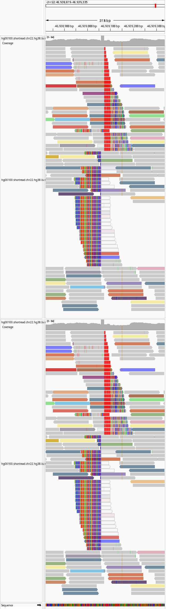
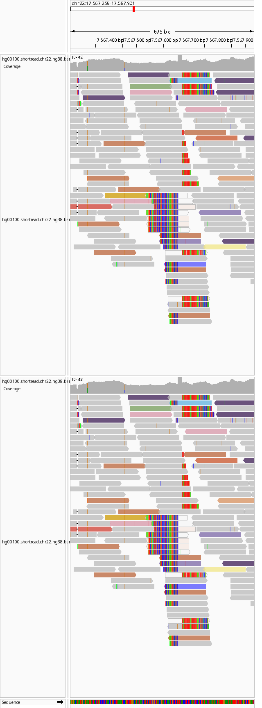
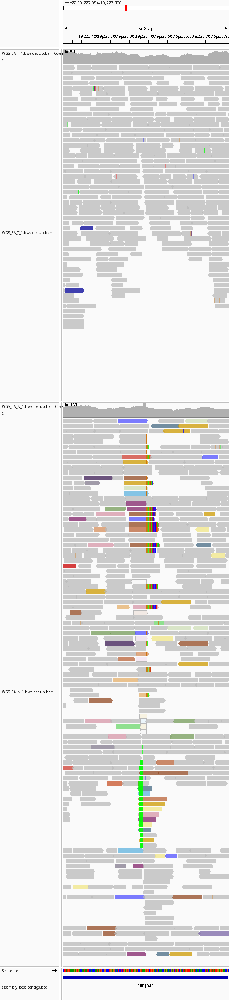
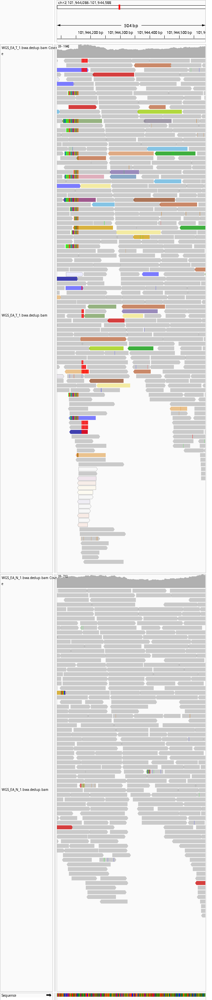
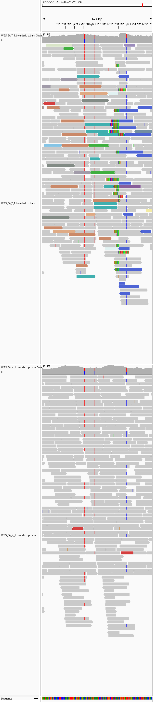
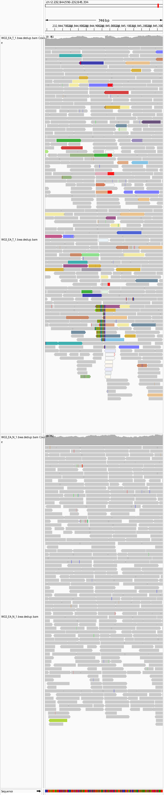
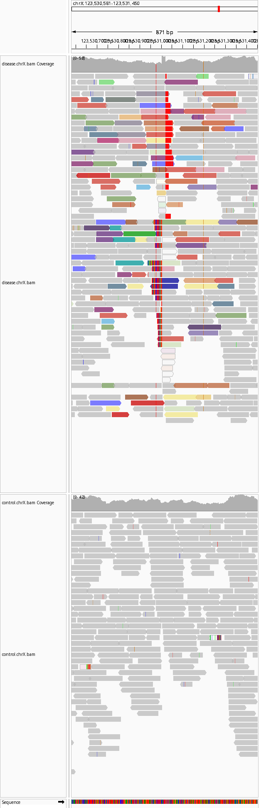
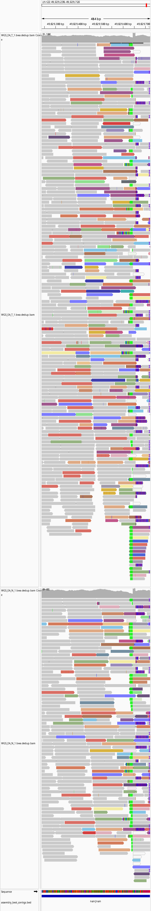

# retrotransposon-miner

Short-read MEI detection and annotation pipeline for LINE-1, Alu, and SVA.

`retrotransposon-miner` searches next-generation sequencing data for retrotransposon (mobile element insertion, MEI) events in the human genome.
Retrotransposons are virus-like elements that can activate under stress and are implicated in disease biology.

The pipeline detects multiple MEI classes and outputs a candidate insertion table annotated with evidence and context useful for triage.

## Repository Metadata

- Repository description: `Retrotransposon MEI caller for short-read WGS with split-read + discordant-pair evidence, candidate ranking, MEI annotation, and IGV snapshot review workflows.`
- GitHub topics: `retrotransposon`, `mobile-element-insertion`, `mei`, `line1`, `alu`, `sva`, `genomics`, `bioinformatics`, `structural-variation`, `nextflow`, `igv`, `jupyterlab`, `aws`, `ec2`.
- Search keywords: `retrotransposon detection`, `mobile element insertion calling`, `LINE-1 insertion`, `Alu insertion`, `SVA insertion`, `short-read MEI pipeline`, `tumor normal MEI`, `germline MEI`, `IGV MEI review`.

## What This Tool Can Do

- Detect MEI candidates from short-read data using split-read and discordant paired-end evidence.
- Support paired disease/control (tumor-normal) workflows and control-focused/germline style analyses.
- Call major retrotransposon classes (`LINE-1`, `Alu`, `SVA`) and report family/subfamily assignments.
- Annotate candidates with:
  - estimated insertion coordinates,
  - polyA/polyT support,
  - target site duplication (TSD) length/sequence when resolvable,
  - overlap with known variant resources (short-read and long-read sets),
  - optional local assembly-derived features.
- Auto-generate review snapshots in IGV (Integrative Genomics Viewer) as PNG files for manual QC.
- Run cleanly in Linux environments with included bootstrap/validation scripts and an EC2-first workflow.

## How It Compares to Other Tools

The table below summarizes `retrotransposon-miner` against commonly used tools (`xTea`, `mobster`, `MELT`, `RetroNet`, `TraFiC`, `TotalReCall`, `MEIba`).  
`retrotransposon-miner` feature claims are based on this repository; other-tool columns are high-level, publicly documented capability summaries and may vary by version/workflow.

Legend: `✅` yes, `❌` no, `➖` limited/partial/not definitive.

| Feature |  | xTea | mobster | MELT | RetroNet | TraFiC | TotalReCall | MEIba |
|---|---|---|---|---|---|---|---|---|
| Split-read support | ✅ | ✅ | ✅ | ✅ | ✅ | ➖ | ➖ | ➖ |
| Discordant paired-end support | ✅ | ✅ | ✅ | ✅ | ➖ | ✅ | ✅ | ➖ |
| Germline analysis | ✅ | ✅ | ✅ | ✅ | ✅ | ➖ | ➖ | ✅ |
| Paired disease/control analysis | ✅ | ✅ | ➖ | ➖ | ➖ | ✅ | ✅ | ➖ |
| Alu / SVA / LINE-1 | ✅ | ✅ | ✅ | ✅ | ✅ | ➖ | ➖ | ➖ |
| hg19 / GRCh38 / hs1 support | ✅ | ➖ | ➖ | ➖ | ➖ | ➖ | ➖ | ➖ |
| Target site duplication (TSD) detection | ✅ | ➖ | ➖ | ➖ | ➖ | ➖ | ➖ | ➖ |
| PolyA/polyT characterization | ✅ | ✅ | ✅ | ➖ | ✅ | ✅ | ✅ | ➖ |
| Annotation of known variant catalogs | ✅ | ➖ | ➖ | ✅ | ➖ | ➖ | ➖ | ➖ |
| Optional local assembly | ✅ | ✅ | ❌ | ❌ | ❌ | ❌ | ❌ | ❌ |
| Cloud support | ✅ | ➖ | ➖ | ➖ | ➖ | ➖ | ➖ | ➖ |
| Linux environment management scripts | ✅ | ➖ | ➖ | ➖ | ➖ | ➖ | ➖ | ➖ |
| IGV + JupyterLab workflow | ✅ | ❌ | ❌ | ❌ | ❌ | ❌ | ❌ | ❌ |

## Current Limitations

- Designed primarily for AWS machines today; relatively straightforward to adapt to GCP, Azure, or local Linux. For larger runs, `r6i.4xlarge` or greater is recommended, and local assembly/candidate processing support parallel execution.
- AI/ML genotyping confidence models are still under active development.
- Reverse-transcribed pseudogene insertion support is not yet added.
- Long-read native calling is not yet supported.
- Local assembly is parallelized but still compute-expensive; it is optional and not recommended by default for routine runs.

## Example Variant Calls (GRCh38)

All examples below are IGV review snapshots generated by the pipeline.

### Example output from sample tumor/normal data

| chrom | consensus_insertion_breakpoint_pos | window_start | window_end | control_supporting_reads | disease_supporting_reads | sample_status_label | consensus_tsd_seq | consensus_poly_at_max_run | consensus_mei_family | consensus_mei_subfamily | known_mei_polymorphism_id | known_mei_polymorphism_source | consensus_insertion_orientation | nested_in_same_MEI | consensus_insertion_mei_span_full | consensus_insertion_mei_5p_coord_full | consensus_insertion_mei_3p_coord_full |
| --- | --- | --- | --- | --- | --- | --- | --- | --- | --- | --- | --- | --- | --- | --- | --- | --- | --- |
| chr22 | 45595639 | 45595608 | 45595813 | SR_L=92,SR_R=0,DPE_L=227,DPE_R=147,MEI_MAPPED=1 | SR_L=67,SR_R=0,DPE_L=55,DPE_R=27,MEI_MAPPED=0 | shared |  | 11 | ALU | FAM#SINE/Alu |  |  | + | unnested | 0 | -1 | -1 |
| chr22 | 49029650 | 49029238 | 49029720 | SR_L=33,SR_R=10,DPE_L=34,DPE_R=60,MEI_MAPPED=2 | SR_L=72,SR_R=20,DPE_L=85,DPE_R=147,MEI_MAPPED=9 | shared | AAGAAAACTCCT | 19 | SVA | SVA_D#Retroposon/SVA | nssv14064350 | melt_1kg | + | unnested | 0 | -1 | -1 |
| chr22 | -1 | 37529016 | 37529555 | SR_L=0,SR_R=1,DPE_L=49,DPE_R=2,MEI_MAPPED=2 | SR_L=0,SR_R=38,DPE_L=141,DPE_R=40,MEI_MAPPED=6 | shared |  | 17 | ALU | AluYb8#SINE/Alu |  |  | + | unnested | 0 | -1 | 231 |
| chr22 | 45166725 | 45166512 | 45167153 | SR_L=14,SR_R=6,DPE_L=12,DPE_R=14,MEI_MAPPED=4 | SR_L=54,SR_R=13,DPE_L=21,DPE_R=42,MEI_MAPPED=6 | shared | AAAGAATTATGTC | 24 | ALU | AluYb9#SINE/Alu | g1k:nssv14054938\|lr:chr22-45651200-INS->s904290<s909202>s904291-125 | melt_1kg,long_read_1kg_ont_vienna | + | unnested | 122 | 197 | 318 |
| chr22 | 19919251 | 19918813 | 19919591 | SR_L=25,SR_R=12,DPE_L=51,DPE_R=72,MEI_MAPPED=2 | SR_L=12,SR_R=8,DPE_L=54,DPE_R=50,MEI_MAPPED=3 | shared |  | 10 | ALU | AluSp#SINE/Alu | nssv14053291 | melt_1kg | - | nested | 64 | 173 | 236 |
| chr22 | 34034610 | 34034397 | 34035039 | SR_L=11,SR_R=12,DPE_L=35,DPE_R=14,MEI_MAPPED=11 | SR_L=15,SR_R=29,DPE_L=45,DPE_R=29,MEI_MAPPED=16 | shared |  | 25 | ALU | AluJr4#SINE/Alu | nssv14071620 | melt_1kg | - | unnested | 26 | 2 | 27 |
| chr22 | -1 | 31355705 | 31355900 | SR_L=7,SR_R=14,DPE_L=17,DPE_R=16,MEI_MAPPED=6 | SR_L=10,SR_R=32,DPE_L=44,DPE_R=37,MEI_MAPPED=4 | shared |  | 6 | ALU | AluSc8#SINE/Alu |  |  | - | nested | 0 | -1 | -1 |
| chr22 | 33132520 | 33132268 | 33132910 | SR_L=30,SR_R=5,DPE_L=31,DPE_R=10,MEI_MAPPED=6 | SR_L=22,SR_R=6,DPE_L=41,DPE_R=45,MEI_MAPPED=11 | shared | AAAAGTCATTATTAG | 27 | ALU | AluJb_short_#SINE/Alu | nssv14075885 | melt_1kg | + | unnested | 313 | 1 | 313 |
| chr22 | -1 | 47908459 | 47908829 | SR_L=6,SR_R=12,DPE_L=2,DPE_R=0,MEI_MAPPED=0 | SR_L=27,SR_R=47,DPE_L=17,DPE_R=6,MEI_MAPPED=3 | shared |  | 25 | ALU | AluSc8#SINE/Alu |  |  | - | nested | 30 | 129 | 158 |
| chr22 | -1 | 25932236 | 25932850 | SR_L=43,SR_R=4,DPE_L=11,DPE_R=4,MEI_MAPPED=1 | SR_L=63,SR_R=8,DPE_L=11,DPE_R=11,MEI_MAPPED=2 | shared |  | 17 | ALU | AluSx3#SINE/Alu |  |  | - | nested | 116 | 28 | 143 |
| chr22 | 22131981 | 22131552 | 22132407 | SR_L=7,SR_R=16,DPE_L=53,DPE_R=35,MEI_MAPPED=3 | SR_L=0,SR_R=0,DPE_L=2,DPE_R=0,MEI_MAPPED=0 | shared | GCATATTTCTT | 17 | LINE1 | L1HS_3end#LINE/L1 | nssv14066334 | melt_1kg | - | unnested | 0 | -1 | -1 |
| chr22 | 34744044 | 34744014 | 34744465 | SR_L=21,SR_R=3,DPE_L=0,DPE_R=6,MEI_MAPPED=2 | SR_L=45,SR_R=8,DPE_L=3,DPE_R=22,MEI_MAPPED=1 | shared |  | 5 | ALU | AluSx1#SINE/Alu |  |  | - | nested | 0 | -1 | -1 |
| chr22 | 17224410 | 17224216 | 17224818 | SR_L=5,SR_R=23,DPE_L=29,DPE_R=28,MEI_MAPPED=6 | SR_L=0,SR_R=0,DPE_L=0,DPE_R=0,MEI_MAPPED=0 | control_only | AACAAGTGCTAATAATTT | 20 | ALU | AluSg7#SINE/Alu | g1k:nssv14074719\|lr:chr22-17900865-INS->s898731>s907592>s898732-334 | melt_1kg,long_read_1kg_ont_vienna | - | unnested | 318 | 1 | 318 |
| chr22 | 31380433 | 31380189 | 31380463 | SR_L=0,SR_R=9,DPE_L=23,DPE_R=4,MEI_MAPPED=2 | SR_L=0,SR_R=26,DPE_L=43,DPE_R=12,MEI_MAPPED=7 | shared |  | 7 | LINE1 | L1PREC2_orf2#LINE/L1 |  |  | - | unnested | 38 | -1 | -1 |
| chr22 | -1 | 43455010 | 43455557 | SR_L=4,SR_R=14,DPE_L=1,DPE_R=2,MEI_MAPPED=2 | SR_L=15,SR_R=38,DPE_L=9,DPE_R=8,MEI_MAPPED=5 | shared |  | 24 | ALU | AluYg6#SINE/Alu |  |  | - | nested | 39 | 34 | 72 |
| chr22 | 19373923 | 19373501 | 19374051 | SR_L=9,SR_R=8,DPE_L=23,DPE_R=2,MEI_MAPPED=1 | SR_L=12,SR_R=21,DPE_L=30,DPE_R=4,MEI_MAPPED=1 | shared |  | 23 | ALU | AluYa8#SINE/Alu | nssv14064468 | melt_1kg | - | unnested | 0 | -1 | -1 |
| chr22 | 19223390 | 19222954 | 19223820 | SR_L=17,SR_R=12,DPE_L=25,DPE_R=11,MEI_MAPPED=16 | SR_L=0,SR_R=0,DPE_L=0,DPE_R=0,MEI_MAPPED=0 | control_only |  | 25 | LINE1 | L1HS_5end#LINE/L1 | g1k:nssv14064681\|lr:chr22-19600083-INS->s899391<s914453>s899392-6059 | melt_1kg,long_read_1kg_ont_vienna | + | unnested | 29 | -1 | -1 |
| chr22 | 17567655 | 17567227 | 17567724 | SR_L=5,SR_R=0,DPE_L=15,DPE_R=31,MEI_MAPPED=6 | SR_L=17,SR_R=0,DPE_L=36,DPE_R=36,MEI_MAPPED=17 | shared |  | 13 | ALU | AluYb8#SINE/Alu | chr22-18235412-INS->s898803>s907604>s907605>s907606>s898804-358 | long_read_1kg_ont_vienna | - | unnested | 28 | 1 | 28 |
| chr22 | 19585579 | 19585499 | 19585963 | SR_L=15,SR_R=0,DPE_L=35,DPE_R=13,MEI_MAPPED=15 | SR_L=0,SR_R=0,DPE_L=0,DPE_R=0,MEI_MAPPED=0 | control_only |  | 10 | ALU | AluSc#SINE/Alu |  |  | - | unnested | 26 | 11 | 36 |
| chr22 | -1 | 31384581 | 31385060 | SR_L=10,SR_R=0,DPE_L=32,DPE_R=12,MEI_MAPPED=25 | SR_L=10,SR_R=0,DPE_L=58,DPE_R=20,MEI_MAPPED=25 | shared |  | 6 | LINE1 | L1PREC2_orf2#LINE/L1 |  |  | - | nested | 309 | -1 | -1 |

### GRCh38 chr22:46938819-46939335 - novel LINE-1 in HG00100



Novel variant in HG00100 not detected by 1000 Genomes short-read or long-read sequencing.  
Evidence includes a LINE-1 insertion, TSD sequence `GAGACACCATTTTT`, an approximately 29 bp polyA tail (shown as red polyT in IGV due to negative-strand orientation), 5' split-read support, and discordant paired-end support on both sides of the breakpoint.

### GRCh38 chr22:17567258-17567931 - full-length Alu known from long-read data



Full-length Alu insertion previously reported only from long-read sequencing (`chr22-18235412-INS->s898803>s907604>s907605>s907606>s898804-358`).  
TSD sequence `TATCCTTGCTTTTAT` and a 12 bp polyA signal are present (negative-strand orientation), with additional A-rich sequence that may have reduced prior short-read detectability.

### GRCh38 chr22:19222954-19223820 - control-only LINE-1 with probable tumor deletion context



LINE-1 insertion seen in control only on positive strand (polyA shown as green block).  
Reduced tumor coverage suggests a clonal deletion of the chromosome carrying this variant; nearby control-only variants are consistent with a larger deletion event in the tumor.

### GRCh38 chr2:101944086-101944588 - tumor-only novel nested LINE-1



Tumor-only novel LINE-1 insertion nested inside another LINE-1 in the same orientation.

### GRCh38 chr2:221250468-221251090 - tumor-only novel non-canonical LINE-1



Additional tumor-only novel LINE-1 insertion with no obvious polyA tail, suggesting possible non-canonical insertion biology.

### GRCh38 chr2:232844590-232845334 - tumor-only novel unnested LINE-1



Additional tumor-only novel LINE-1 insertion that is unnested.

### GRCh38 chrX:123530581-123531450 - tumor-only novel nested LINE-1



Novel tumor-only nested LINE-1 insertion on chromosome X.

### GRCh38 chr22:49029238-49029720 - known SVA from short-read data



SVA insertion present in 1000 Genomes short-read data but not reported in matched long-read data.

## Getting Started on EC2 (Up and Running)

For whole-genome runs, use at least `r6i.4xlarge`.

### Quickstart Runs (chr22)

Use the main workflow wrapper:

- `scripts/run_candidate_discovery_and_annotation.sh`

Important: these quickstart commands do not download reference/public inputs automatically.

Step 0: download public/reference data first using the provided script:

```bash
conda activate rtm-miner || micromamba activate rtm-miner
python3 scripts/download_public_data.py \
  --references hg38 \
  --outdir "${RTM_PUBLIC_DATA_DIR:-$HOME/retrotransposon-workdir/data/public}"
```

If you plan to run both GRCh38 and hs1 workflows:

```bash
conda activate rtm-miner || micromamba activate rtm-miner
python3 scripts/download_public_data.py \
  --references hg38 hs1 \
  --outdir "${RTM_PUBLIC_DATA_DIR:-$HOME/retrotransposon-workdir/data/public}"
```

Tumor/normal chr22 quickstart (SEQC2 public test pair):

```bash
bash scripts/run_candidate_discovery_and_annotation.sh \
  --reference-build hg38 \
  --disease-bam "${RTM_PUBLIC_DATA_DIR:-$HOME/retrotransposon-workdir/data/public}/test_data/seqc2/chr22/disease.chr22.hg38.bam" \
  --control-bam "${RTM_PUBLIC_DATA_DIR:-$HOME/retrotransposon-workdir/data/public}/test_data/seqc2/chr22/control.chr22.hg38.bam" \
  --mei-fasta "${RTM_PUBLIC_DATA_DIR:-$HOME/retrotransposon-workdir/data/public}/retrotransposon_db/dfam/dfam_human_mei_l1_alu_sva.fasta" \
  --chr chr22 \
  --outdir "${RTM_RESULTS_DIR:-$HOME/retrotransposon-workdir/results}/quickstart_seqc2_chr22"
```

HG0001-style germline/control chr22 quickstart (replace with your BAM path):

```bash
bash scripts/run_candidate_discovery_and_annotation.sh \
  --reference-build hg38 \
  --disease-bam "/path/to/HG0001.chr22.hg38.bam" \
  --control-bam "/path/to/HG0001.chr22.hg38.bam" \
  --mei-fasta "${RTM_PUBLIC_DATA_DIR:-$HOME/retrotransposon-workdir/data/public}/retrotransposon_db/dfam/dfam_human_mei_l1_alu_sva.fasta" \
  --chr chr22 \
  --outdir "${RTM_RESULTS_DIR:-$HOME/retrotransposon-workdir/results}/quickstart_hg0001_chr22"
```

### Quick Start

From your local machine:

```bash
git clone https://github.com/<org>/retrotransposon-miner.git
cd retrotransposon-miner
chmod +x scripts/ec2_jlab.sh
./scripts/ec2_jlab.sh bootstrap
```

After bootstrap:
- SSH to instance: `ssh retro-ec2`
- Open JupyterLab locally: `http://127.0.0.1:8890/lab?token=<printed-token>`

### Prerequisites

Local tools:
- `aws` CLI v2 (`aws configure` complete)
- `ssh`
- `curl`
- `git`

IAM permissions:
- `ec2:Describe*`
- `ec2:RunInstances`
- `ec2:StartInstances`
- `ec2:StopInstances`
- `ec2:RebootInstances`
- `ec2:CreateTags`
- `ec2:CreateKeyPair`
- `ec2:DeleteKeyPair` (optional)
- `ec2:CreateSecurityGroup`
- `ec2:AuthorizeSecurityGroupIngress`
- `ec2:AllocateAddress`
- `ec2:AssociateAddress`
- `ec2:DescribeAddresses`
- `ec2:DescribeVpcs`
- `ec2:DescribeSubnets`
- `ssm:GetParameter` (Amazon Linux AMI lookup)
- `iam:PassRole` (if attaching an instance profile)

### What `scripts/ec2_jlab.sh` Does

- Creates/reuses an EC2 instance by `Name` tag.
- Creates/reuses local SSH key material.
- Creates/reuses a security group with SSH access limited to your current public IP.
- Starts instance and waits for health checks.
- Allocates/associates an Elastic IP.
- Writes SSH aliases (`retro-ec2`, `jlab`) into local `~/.ssh/config`.
- Starts JupyterLab remotely and tunnel locally.

### Provision and Operate

```bash
cd retrotransposon-miner
./scripts/ec2_jlab.sh bootstrap
./scripts/ec2_jlab.sh status
./scripts/ec2_jlab.sh stop-instance
./scripts/ec2_jlab.sh start-instance
./scripts/ec2_jlab.sh reboot-instance
./scripts/ec2_jlab.sh start-jlab
./scripts/ec2_jlab.sh stop-jlab
./scripts/ec2_jlab.sh start-tunnel
```

SSH:

```bash
ssh retro-ec2
```

### Sync Repository on VM

```bash
cd ~
git clone https://github.com/<org>/retrotransposon-miner.git
cd retrotransposon-miner
```

### Install Environment on VM

```bash
bash scripts/bootstrap_env.sh
bash scripts/install_ucsc_tools.sh
conda activate rtm-miner || micromamba activate rtm-miner
bash scripts/validate_environment.sh
```

If needed:

```bash
eval "$($HOME/.local/bin/micromamba shell hook -s bash)"
micromamba activate rtm-miner
```

### Download Public Data

GRCh38:

```bash
conda activate rtm-miner || micromamba activate rtm-miner
python3 scripts/download_public_data.py \
  --references hg38 \
  --outdir "${RTM_PUBLIC_DATA_DIR:-$HOME/retrotransposon-workdir/data/public}"
```

hs1:

```bash
conda activate rtm-miner || micromamba activate rtm-miner
python3 scripts/download_public_data.py \
  --references hs1 \
  --outdir "${RTM_PUBLIC_DATA_DIR:-$HOME/retrotransposon-workdir/data/public}"
```

Both:

```bash
conda activate rtm-miner || micromamba activate rtm-miner
python3 scripts/download_public_data.py \
  --references hg38 hs1 \
  --outdir "${RTM_PUBLIC_DATA_DIR:-$HOME/retrotransposon-workdir/data/public}"
```

### Connect From Cursor

1. Open command palette.
2. Run `Remote-SSH: Connect to Host...`
3. Select `retro-ec2`.
4. Open `~/retrotransposon-miner`.

### Notes

- Designed for headless Linux execution with optional IGV snapshot generation.
- If your public IP changes, rerun `bootstrap` to refresh security group ingress.
- For production use, review security hardening, key lifecycle, and cost controls.

## License

This project is licensed under the Apache License 2.0.

- Full text: [`LICENSE`](LICENSE)
- SPDX identifier: `Apache-2.0`

## Contributing

Contributions are welcome and encouraged.

- Contribution guide: [`CONTRIBUTING.md`](CONTRIBUTING.md)
- Community standards: [`CODE_OF_CONDUCT.md`](CODE_OF_CONDUCT.md)
- Contact: open a GitHub issue/discussion first, or email `william [at] l1tx [dot] com`.

If you submit code, please include clear validation steps and update documentation when behavior changes.
