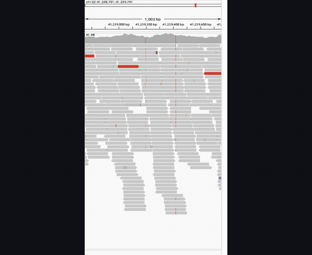
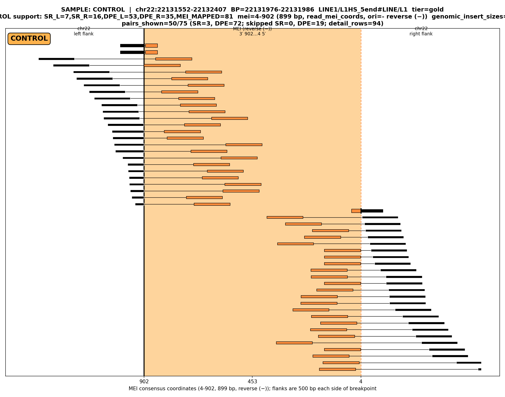

# retrotransposon-miner

Short-read mobile element insertion (MEI) detection and annotation pipeline for LINE-1, Alu, and SVA.

`retrotransposon-miner` searches next-generation sequencing data for retrotransposon (mobile element insertion, MEI) events in the human genome.
Retrotransposons are virus-like elements that can activate under stress and are implicated in disease biology.

The pipeline detects multiple MEI classes and outputs a candidate insertion table annotated with evidence and context useful for triage.

## What This Tool Can Do

- Detect mobile element insertion (MEI) candidates from short-read data using split-read and discordant paired-end evidence.
- Support paired disease/control (tumor-normal) workflows and control-focused/germline style analyses.
- Call major retrotransposon classes (`LINE-1`, `Alu`, `SVA`) and report family/subfamily assignments.
- Annotate candidates with:
  - estimated insertion coordinates,
  - polyA/polyT support,
  - target site duplication (TSD) length/sequence when resolvable,
  - overlap with known variant resources (short-read and long-read sets),
  - optional local assembly-derived features.
- Auto-generate review snapshots in IGV (Integrative Genomics Viewer) as PNG files for manual QC.
- Run cleanly in Linux environments with included bootstrap/validation scripts and an Amazon Elastic Compute Cloud (EC2)-first workflow.

## How It Compares to Other Tools

The table below summarizes `retrotransposon-miner` against commonly used tools (`xTea`, `mobster`, `MELT`, `RetroNet`, `TraFiC`, `TotalReCall`, `MEIba`).  
`retrotransposon-miner` feature claims are based on this repository; other-tool columns are high-level, publicly documented capability summaries and may vary by version/workflow.

Legend: `✅` yes, `❌` no, `➖` limited/partial/not definitive.

| Feature |  | xTea | mobster | MELT | RetroNet | TraFiC | TotalReCall | MEIba |
|---|---|---|---|---|---|---|---|---|
| Split-read support | ✅ | ✅ | ✅ | ✅ | ✅ | ➖ | ➖ | ➖ |
| Discordant paired-end support | ✅ | ✅ | ✅ | ✅ | ➖ | ✅ | ✅ | ➖ |
| Germline analysis | ✅ | ✅ | ✅ | ✅ | ✅ | ➖ | ➖ | ✅ |
| Paired disease/control analysis | ✅ | ✅ | ➖ | ➖ | ➖ | ✅ | ✅ | ➖ |
| Alu / SVA / LINE-1 | ✅ | ✅ | ✅ | ✅ | ✅ | ➖ | ➖ | ➖ |
| hg19 / GRCh38 / hs1 support | ✅ | ➖ | ➖ | ➖ | ➖ | ➖ | ➖ | ➖ |
| Target site duplication (TSD) detection | ✅ | ➖ | ➖ | ➖ | ➖ | ➖ | ➖ | ➖ |
| PolyA/polyT characterization | ✅ | ✅ | ✅ | ➖ | ✅ | ✅ | ✅ | ➖ |
| Annotation of known variant catalogs | ✅ | ➖ | ➖ | ✅ | ➖ | ➖ | ➖ | ➖ |
| Optional local assembly | ✅ | ✅ | ❌ | ❌ | ❌ | ❌ | ❌ | ❌ |
| Cloud support | ✅ | ➖ | ➖ | ➖ | ➖ | ➖ | ➖ | ➖ |
| Linux environment management scripts | ✅ | ➖ | ➖ | ➖ | ➖ | ➖ | ➖ | ➖ |
| Integrative Genomics Viewer (IGV) + JupyterLab workflow | ✅ | ❌ | ❌ | ❌ | ❌ | ❌ | ❌ | ❌ |

## Current Limitations

- Designed primarily for Amazon Web Services (AWS) machines today; relatively straightforward to adapt to Google Cloud Platform (GCP), Azure, or local Linux. For larger runs, `r6i.4xlarge` or greater is recommended, and local assembly/candidate processing support parallel execution.
- Artificial intelligence/machine learning (AI/ML) genotyping confidence models are still under active development.
- Reverse-transcribed pseudogene insertion support is not yet added.
- Support for species other than *Homo sapiens* (for example, *Mus musculus*) is not yet implemented.
- Long-read native calling is not yet supported.
- Single-cell sequencing data is not yet supported.
- Other short-read platforms (for example, Ultima Genomics) are not yet validated/supported.
- Local assembly is parallelized but still compute-expensive; it is optional and not recommended by default for routine runs.

## Example Variant Calls (GRCh38)

The table below lists candidate insertion calls from a tumor/normal chr22 run.  
In the example table, `SR` denotes split-read evidence and `DPE` denotes discordant paired-end evidence.

### Example output from sample tumor/normal data

| chrom | consensus_insertion_breakpoint_pos | window_start | window_end | control_supporting_reads | disease_supporting_reads | sample_status_label | consensus_tsd_seq | consensus_poly_at_max_run | consensus_mei_family | consensus_mei_subfamily | known_mei_polymorphism_id | known_mei_polymorphism_source | consensus_insertion_orientation | nested_in_same_MEI | consensus_insertion_mei_span_full | consensus_insertion_mei_5p_coord_full | consensus_insertion_mei_3p_coord_full |
| --- | --- | --- | --- | --- | --- | --- | --- | --- | --- | --- | --- | --- | --- | --- | --- | --- | --- |
| chr22 | 49029650 | 49029238 | 49029720 | SR_L=33,SR_R=10,DPE_L=34,DPE_R=60,MEI_MAPPED=86 | SR_L=72,SR_R=20,DPE_L=85,DPE_R=147,MEI_MAPPED=211 | shared | AAGAAAACTCCT | 19 | SVA | SVA_F#Retroposon/SVA | nssv14064350 | melt_1kg | + | unnested | 257 | 97 | 353 |
| chr22 | -1 | 50495289 | 50495747 | SR_L=0,SR_R=0,DPE_L=20,DPE_R=48,MEI_MAPPED=39 | SR_L=3,SR_R=0,DPE_L=60,DPE_R=100,MEI_MAPPED=97 | shared |  | 11 | ALU | AluSc8#SINE/Alu |  |  | - | unnested | 51 | 40 | 90 |
| chr22 | 22131981 | 22131552 | 22132407 | SR_L=7,SR_R=16,DPE_L=53,DPE_R=35,MEI_MAPPED=81 | SR_L=0,SR_R=0,DPE_L=2,DPE_R=0,MEI_MAPPED=0 | shared | GCATATTTCTT | 17 | LINE1 | L1HS_5end#LINE/L1 | nssv14066334 | melt_1kg | - | unnested | 598 | 89 | 686 |
| chr22 | 33132520 | 33132268 | 33132910 | SR_L=30,SR_R=5,DPE_L=31,DPE_R=10,MEI_MAPPED=39 | SR_L=22,SR_R=6,DPE_L=41,DPE_R=45,MEI_MAPPED=74 | shared | AAAAGTCATTATTAG | 27 | ALU | AluJb_short_#SINE/Alu | nssv14075885 | melt_1kg | + | unnested | 171 | 87 | 257 |
| chr22 | 17567655 | 17567227 | 17567724 | SR_L=5,SR_R=0,DPE_L=15,DPE_R=31,MEI_MAPPED=45 | SR_L=17,SR_R=0,DPE_L=36,DPE_R=36,MEI_MAPPED=73 | shared |  | 13 | ALU | AluY_short_#SINE/Alu | chr22-18235412-INS->s898803>s907604>s907605>s907606>s898804-358 | long_read_1kg_ont_vienna | - | unnested | 88 | 121 | 208 |
| chr22 | 34034616 | 34034397 | 34035039 | SR_L=11,SR_R=12,DPE_L=35,DPE_R=14,MEI_MAPPED=48 | SR_L=15,SR_R=29,DPE_L=45,DPE_R=29,MEI_MAPPED=69 | shared | CAAATGGAACTTTT | 25 | ALU | AluYb8#SINE/Alu | nssv14071620 | melt_1kg | - | unnested | 37 | 83 | 119 |
| chr22 | 31355872 | 31355705 | 31355900 | SR_L=7,SR_R=14,DPE_L=17,DPE_R=16,MEI_MAPPED=21 | SR_L=10,SR_R=32,DPE_L=44,DPE_R=37,MEI_MAPPED=55 | shared | GCCCGCCTCGGCTTCCCAAAGTGCTGGGATTACA | 6 | ALU | AluSx#SINE/Alu |  |  | - | nested | 21 | 171 | 191 |
| chr22 | 17224410 | 17224216 | 17224818 | SR_L=5,SR_R=23,DPE_L=29,DPE_R=28,MEI_MAPPED=53 | SR_L=0,SR_R=0,DPE_L=0,DPE_R=0,MEI_MAPPED=0 | control_only | AACAAGTGCTAATAATTT | 20 | ALU | AluYb8#SINE/Alu | g1k:nssv14074719\|lr:chr22-17900865-INS->s898731>s907592>s898732-334 | melt_1kg,long_read_1kg_ont_vienna | - | unnested | 311 | 1 | 311 |
| chr22 | 45166725 | 45166512 | 45167153 | SR_L=14,SR_R=6,DPE_L=12,DPE_R=14,MEI_MAPPED=22 | SR_L=54,SR_R=13,DPE_L=21,DPE_R=42,MEI_MAPPED=50 | shared | AAAGAATTATGTC | 26 | ALU | AluSz#SINE/Alu | g1k:nssv14054938\|lr:chr22-45651200-INS->s904290<s909202>s904291-125 | melt_1kg,long_read_1kg_ont_vienna | + | unnested | 122 | 197 | 318 |
| chr22 | -1 | 20520666 | 20521177 | SR_L=1,SR_R=6,DPE_L=15,DPE_R=26,MEI_MAPPED=30 | SR_L=2,SR_R=4,DPE_L=33,DPE_R=26,MEI_MAPPED=49 | shared |  | 25 | ALU | AluJb#SINE/Alu |  |  | - | unnested | 63 | 88 | 150 |
| chr22 | 19223382 | 19222954 | 19223820 | SR_L=17,SR_R=12,DPE_L=25,DPE_R=11,MEI_MAPPED=41 | SR_L=0,SR_R=0,DPE_L=0,DPE_R=0,MEI_MAPPED=0 | control_only | AAAAACCACCTATGCTGG | 25 | LINE1 | L1HS_3end#LINE/L1 | g1k:nssv14064681\|lr:chr22-19600083-INS->s899391<s914453>s899392-6059 | melt_1kg,long_read_1kg_ont_vienna | + | unnested | 234 | 480 | 713 |
| chr22 | -1 | 41050146 | 41050336 | SR_L=3,SR_R=0,DPE_L=13,DPE_R=26,MEI_MAPPED=29 | SR_L=1,SR_R=0,DPE_L=32,DPE_R=48,MEI_MAPPED=41 | shared |  | 24 | ALU | AluSg7#SINE/Alu |  |  | - | nested | 89 | 88 | 176 |
| chr22 | 17289460 | 17289038 | 17289490 | SR_L=0,SR_R=9,DPE_L=17,DPE_R=18,MEI_MAPPED=20 | SR_L=0,SR_R=10,DPE_L=31,DPE_R=28,MEI_MAPPED=40 | shared |  | 7 | LINE1 | L1P2_5end#LINE/L1 |  |  | - | unnested | 0 | -1 | -1 |
| chr22 | -1 | 36751791 | 36752260 | SR_L=1,SR_R=0,DPE_L=46,DPE_R=29,MEI_MAPPED=26 | SR_L=0,SR_R=0,DPE_L=105,DPE_R=62,MEI_MAPPED=37 | shared |  | 10 | ALU | AluSz#SINE/Alu |  |  | - | unnested | 0 | -1 | 74 |
| chr22 | -1 | 41049693 | 41050193 | SR_L=0,SR_R=0,DPE_L=9,DPE_R=31,MEI_MAPPED=14 | SR_L=1,SR_R=0,DPE_L=24,DPE_R=54,MEI_MAPPED=33 | shared |  | 19 | ALU | AluSg7#SINE/Alu |  |  | + | unnested | 31 | 190 | 220 |
| chr22 | -1 | 42818786 | 42819228 | SR_L=0,SR_R=19,DPE_L=17,DPE_R=17,MEI_MAPPED=32 | SR_L=0,SR_R=0,DPE_L=0,DPE_R=0,MEI_MAPPED=0 | control_only |  | 20 | ALU | AluSx1#SINE/Alu | chr22-43299733-INS->s903600<s909229>s903601-318 | long_read_1kg_ont_vienna | - | unnested | 91 | 67 | 157 |
| chr22 | -1 | 35735269 | 35735448 | SR_L=3,SR_R=0,DPE_L=10,DPE_R=31,MEI_MAPPED=32 | SR_L=0,SR_R=0,DPE_L=10,DPE_R=22,MEI_MAPPED=24 | shared |  | 5 | ALU | AluSq2#SINE/Alu |  |  | - | nested | 42 | 29 | 70 |
| chr22 | -1 | 50495021 | 50495347 | SR_L=0,SR_R=0,DPE_L=4,DPE_R=48,MEI_MAPPED=25 | SR_L=0,SR_R=1,DPE_L=18,DPE_R=62,MEI_MAPPED=32 | shared |  | 14 | ALU | AluSc#SINE/Alu |  |  | - | nested | 49 | 97 | 145 |
| chr22 | -1 | 37528720 | 37529074 | SR_L=0,SR_R=0,DPE_L=32,DPE_R=37,MEI_MAPPED=15 | SR_L=1,SR_R=0,DPE_L=70,DPE_R=100,MEI_MAPPED=31 | shared |  | 5 | ALU | AluSc#SINE/Alu |  |  | + | unnested | 0 | -1 | -1 |
| chr22 | -1 | 23853256 | 23853640 | SR_L=0,SR_R=0,DPE_L=15,DPE_R=9,MEI_MAPPED=17 | SR_L=0,SR_R=1,DPE_L=21,DPE_R=27,MEI_MAPPED=30 | shared |  | 9 | ALU | AluY_short_#SINE/Alu |  |  | - | unnested | 95 | 128 | 222 |

## Examples

See [`docs/EXAMPLES.md`](docs/EXAMPLES.md) for additional annotated IGV review snapshots and read-architecture plots.

### Illumina



The gif shows screenshots from random sections of chromosome 22 in a healthy individual. Grey bars represent unmutated DNA, and colors indicate either a mutation or errors in sequencing. The final screenshot shows a barcode-like signature indicating a retrotransposon insertion at one location. This insertion was not previously reported in this individual in published studies using the same data.

### LINE-1 insertion (GRCh38 chr22:22131981)



Known LINE-1 (`L1HS`) insertion with split-read and discordant paired-end support into a reverse-oriented MEI consensus (`nssv14066334`). Black segments map to chr22 flanks; orange segments map to the LINE-1 consensus.

## Getting Started on Amazon EC2 (Elastic Compute Cloud)

For whole-genome runs, use at least `r6i.4xlarge`.

The EC2 helper script (`scripts/ec2_jlab.sh`) works with **any existing EC2 instance** in your AWS account. Instance IDs and names are **not hardcoded in the repository**; each user binds their own instance locally to `.ec2-instance.env` (gitignored).

Run `./scripts/ec2_jlab.sh help` for the full command list.

### Quick Start (Bring Your Own EC2)

From your local machine:

```bash
git clone https://github.com/<org>/retrotransposon-miner.git
cd retrotransposon-miner
chmod +x scripts/ec2_jlab.sh
./scripts/ec2_jlab.sh list-instances
./scripts/ec2_jlab.sh use <instance-id-or-name>
./scripts/ec2_jlab.sh up
ssh retro-ec2
```

One-shot bind, start, and SSH config:

```bash
./scripts/ec2_jlab.sh up <instance-id-or-name>
./scripts/ec2_jlab.sh connect
```

After the instance is running:
- Secure Shell (SSH): `ssh retro-ec2`
- JupyterLab (after `start-jlab` + `start-tunnel`): `http://127.0.0.1:8890/lab?token=<printed-token>`

### Create a New EC2 Instance

Use `bootstrap` only when you want the script to provision a new instance (key pair, security group, Elastic IP, JupyterLab):

```bash
./scripts/ec2_jlab.sh bootstrap
```

`start-instance`, `stop-instance`, and `reboot-instance` operate on the **bound** instance only and do not create new instances.

### EC2 CLI Reference

| Command | Description |
|---|---|
| `list-instances` | List EC2 instances in the configured region |
| `use <instance-id-or-name>` | Bind an instance (by ID or `Name` tag) and update SSH config |
| `up [instance-id-or-name]` | Bind (optional), start, refresh SSH config |
| `connect [instance-id-or-name]` | `up` + SSH |
| `status` | Show bound instance state |
| `start-instance` | Start the bound instance |
| `stop-instance` | Stop the bound instance |
| `reboot-instance` | Reboot the bound instance |
| `bootstrap` | Create and configure a new EC2 instance |
| `start-jlab` / `stop-jlab` / `start-tunnel` | JupyterLab lifecycle |
| `help` | Show usage |

Optional environment variables:

- `REGION` — AWS region (default: from `aws configure`, else `us-east-1`)
- `INSTANCE_ID` / `INSTANCE_NAME` — override bound instance without editing `.ec2-instance.env`
- `HOST_ALIAS` — SSH config alias (default: `retro-ec2`)
- `SSH_USER` — SSH login user (auto-detected from AMI if unset; e.g. `ec2-user`, `ubuntu`)
- `KEY_PATH` — path to PEM for the instance key pair
- `INSTANCE_TYPE` — instance type for `bootstrap` only (default: `r6i.4xlarge`)

Binding is saved to `.ec2-instance.env` in the repo checkout. Rebind anytime with `use`.

### Prerequisites

Local tools:
- `aws` command-line interface (CLI) v2 (`aws configure` complete)
- `ssh`
- `curl`
- `git`

Identity and Access Management (IAM) permissions:

For bring-your-own-EC2 (`use`, `up`, `connect`, lifecycle commands):
- `ec2:Describe*`
- `ec2:StartInstances`
- `ec2:StopInstances`
- `ec2:RebootInstances`
- `ec2:AuthorizeSecurityGroupIngress` (SSH proxy refreshes your current IP on connect)

Additional permissions for `bootstrap` (new instance provisioning):
- `ec2:RunInstances`
- `ec2:CreateTags`
- `ec2:CreateKeyPair`
- `ec2:CreateSecurityGroup`
- `ec2:AllocateAddress`
- `ec2:AssociateAddress`
- `ec2:DescribeAddresses`
- `ec2:DescribeVpcs`
- `ec2:DescribeSubnets`
- `ssm:GetParameter` (Amazon Linux AMI lookup)
- `iam:PassRole` (if attaching an instance profile)

### What `scripts/ec2_jlab.sh` Does

- Binds to any existing EC2 instance by ID or `Name` tag (`use`).
- Saves the binding locally in `.ec2-instance.env` (not committed to git).
- Starts, stops, and reboots the bound instance without creating new ones.
- Writes SSH aliases (`retro-ec2`, `jlab`) into local `~/.ssh/config`.
- Refreshes SSH security group ingress for your current public IP on connect.
- Optionally creates a new instance (`bootstrap`), key pair, security group, and Elastic IP.
- Starts JupyterLab remotely and tunnels it locally.

### Quickstart Runs (chr22)

Use the main workflow wrapper:

- `scripts/run_candidate_discovery_and_annotation.sh`

Important: these quickstart commands do not download reference/public inputs automatically.

Step 0: download public/reference data first using the provided script:

```bash
conda activate rtm-miner || micromamba activate rtm-miner
python3 scripts/download_public_data.py \
  --references hg38 \
  --categories test_bam \
  --outdir "${RTM_PUBLIC_DATA_DIR:-$HOME/retrotransposon-workdir/data/public}"
```

SEQC2 chr22 test BAMs are sliced to chr22 **plus interchrom discordant mates** (needed for
discordant-mate MEI minimap alignment). Re-download with `--force` after updating the downloader.

If you plan to run both GRCh38 and hs1 workflows:

```bash
conda activate rtm-miner || micromamba activate rtm-miner
python3 scripts/download_public_data.py \
  --references hg38 hs1 \
  --outdir "${RTM_PUBLIC_DATA_DIR:-$HOME/retrotransposon-workdir/data/public}"
```

Tumor/normal chr22 quickstart (SEQC2 public test pair):

Local assembly is **off by default** (faster; sufficient for minimap mate mapping and
`supporting_reads_detail.mei.tsv`). Pass `--local-assembly` when you need `asm_*`
breakpoint/TSD fields from per-locus SPAdes.

```bash
RUN_IN_ENV=1 bash scripts/run_candidate_discovery_and_annotation.sh \
  --reference-build hg38 \
  --disease-bam "${RTM_PUBLIC_DATA_DIR:-$HOME/retrotransposon-workdir/data/public}/test_data/seqc2/chr22/disease.chr22.hg38.bam" \
  --control-bam "${RTM_PUBLIC_DATA_DIR:-$HOME/retrotransposon-workdir/data/public}/test_data/seqc2/chr22/control.chr22.hg38.bam" \
  --disease-mate-bam "${RTM_PUBLIC_DATA_DIR:-$HOME/retrotransposon-workdir/data/public}/test_data/seqc2/chr22/disease.chr22.hg38.bam" \
  --control-mate-bam "${RTM_PUBLIC_DATA_DIR:-$HOME/retrotransposon-workdir/data/public}/test_data/seqc2/chr22/control.chr22.hg38.bam" \
  --mei-fasta "${RTM_PUBLIC_DATA_DIR:-$HOME/retrotransposon-workdir/data/public}/retrotransposon_db/dfam/dfam_human_mei_l1_alu_sva.fasta" \
  --chr chr22 \
  --outdir "${RTM_RESULTS_DIR:-$HOME/retrotransposon-workdir/results}/quickstart_seqc2_chr22"
```

For SEQC2 chr22 BAMs built with `include_discordant_mates`, point `--disease-mate-bam` /
`--control-mate-bam` at the same files as `--disease-bam` / `--control-bam`.

Re-run annotation only (reuse existing `split_evidence.*` / `candidate_loci.tsv` after code or
BAM changes that affect minimap mate alignment). Local assembly stays off unless you pass
`--local-assembly`:

```bash
RUN_IN_ENV=1 bash scripts/run_candidate_discovery_and_annotation.sh \
  --reference-build hg38 \
  --annotate-only \
  --disease-bam "${RTM_PUBLIC_DATA_DIR:-$HOME/retrotransposon-workdir/data/public}/test_data/seqc2/chr22/disease.chr22.hg38.bam" \
  --control-bam "${RTM_PUBLIC_DATA_DIR:-$HOME/retrotransposon-workdir/data/public}/test_data/seqc2/chr22/control.chr22.hg38.bam" \
  --disease-mate-bam "${RTM_PUBLIC_DATA_DIR:-$HOME/retrotransposon-workdir/data/public}/test_data/seqc2/chr22/disease.chr22.hg38.bam" \
  --control-mate-bam "${RTM_PUBLIC_DATA_DIR:-$HOME/retrotransposon-workdir/data/public}/test_data/seqc2/chr22/control.chr22.hg38.bam" \
  --mei-fasta "${RTM_PUBLIC_DATA_DIR:-$HOME/retrotransposon-workdir/data/public}/retrotransposon_db/dfam/dfam_human_mei_l1_alu_sva.fasta" \
  --chr chr22 \
  --outdir "${RTM_RESULTS_DIR:-$HOME/retrotransposon-workdir/results}/mei_step1_hg38_chr22"
```

Pipeline outputs include `supporting_reads_detail.mei.tsv` (per-read anchor/mate MEI coords for
architecture plots). Example plot for one gold locus:

```bash
python scripts/plot_locus_read_architecture.py \
  --gold-review-tsv "${RTM_RESULTS_DIR:-$HOME/retrotransposon-workdir/results}/quickstart_seqc2_chr22/candidate_loci.mei.gold_review.tsv" \
  --chrom chr22 --pos 49029650 --sample disease \
  --out-png "${RTM_RESULTS_DIR:-$HOME/retrotransposon-workdir/results}/quickstart_seqc2_chr22/plots/read_arch_chr22_49029650.png"
```

HG0001-style germline/control chr22 quickstart (replace with your BAM path):

```bash
bash scripts/run_candidate_discovery_and_annotation.sh \
  --reference-build hg38 \
  --disease-bam "/path/to/HG0001.chr22.hg38.bam" \
  --control-bam "/path/to/HG0001.chr22.hg38.bam" \
  --mei-fasta "${RTM_PUBLIC_DATA_DIR:-$HOME/retrotransposon-workdir/data/public}/retrotransposon_db/dfam/dfam_human_mei_l1_alu_sva.fasta" \
  --chr chr22 \
  --outdir "${RTM_RESULTS_DIR:-$HOME/retrotransposon-workdir/results}/quickstart_hg0001_chr22"
```

### Sync Repository on Virtual Machine (VM)

```bash
cd ~
git clone https://github.com/<org>/retrotransposon-miner.git
cd retrotransposon-miner
```

### Install Environment on Virtual Machine (VM)

```bash
bash scripts/bootstrap_env.sh
bash scripts/install_ucsc_tools.sh
conda activate rtm-miner || micromamba activate rtm-miner
bash scripts/validate_environment.sh
```

If needed:

```bash
eval "$($HOME/.local/bin/micromamba shell hook -s bash)"
micromamba activate rtm-miner
```

### Download Public Data

GRCh38:

```bash
conda activate rtm-miner || micromamba activate rtm-miner
python3 scripts/download_public_data.py \
  --references hg38 \
  --outdir "${RTM_PUBLIC_DATA_DIR:-$HOME/retrotransposon-workdir/data/public}"
```

hs1:

```bash
conda activate rtm-miner || micromamba activate rtm-miner
python3 scripts/download_public_data.py \
  --references hs1 \
  --outdir "${RTM_PUBLIC_DATA_DIR:-$HOME/retrotransposon-workdir/data/public}"
```

Both:

```bash
conda activate rtm-miner || micromamba activate rtm-miner
python3 scripts/download_public_data.py \
  --references hg38 hs1 \
  --outdir "${RTM_PUBLIC_DATA_DIR:-$HOME/retrotransposon-workdir/data/public}"
```

### Connect From Cursor

1. Open command palette.
2. Run `Remote-SSH: Connect to Host...`
3. Select `retro-ec2`.
4. Open `~/retrotransposon-miner`.

### Notes

- Designed for headless Linux execution with optional Integrative Genomics Viewer (IGV) snapshot generation.
- Instance bindings are local (`.ec2-instance.env`); nothing instance-specific is committed to git.
- If your public IP changes, SSH connect refreshes security group ingress automatically via `ec2_jlab.sh`.
- Set `KEY_PATH` if your PEM is not in `~/.ssh/` or the default search paths.
- For production use, review security hardening, key lifecycle, and cost controls.

## License

This project is licensed under the Apache License 2.0.

- Full text: [`LICENSE`](LICENSE)
- SPDX identifier: `Apache-2.0`

## Contributing

Contributions are welcome and encouraged.

- Contribution guide: [`CONTRIBUTING.md`](CONTRIBUTING.md)
- Community standards: [`CODE_OF_CONDUCT.md`](CODE_OF_CONDUCT.md)
- Contact: open a GitHub issue/discussion first, or email `william [at] l1tx [dot] com`.

If you submit code, please include clear validation steps and update documentation when behavior changes.

## Repository Metadata

- Repository description: `Retrotransposon mobile element insertion (MEI) caller for short-read whole-genome sequencing (WGS) with split-read + discordant-pair evidence, candidate ranking, MEI annotation, and Integrative Genomics Viewer (IGV) snapshot review workflows.`
- GitHub topics: `retrotransposon`, `mobile-element-insertion`, `mei`, `line1`, `alu`, `sva`, `genomics`, `bioinformatics`, `structural-variation`, `nextflow`, `igv`, `jupyterlab`, `aws`, `ec2`.
- Search keywords: `retrotransposon detection`, `mobile element insertion calling`, `LINE-1 insertion`, `Alu insertion`, `SVA insertion`, `short-read MEI pipeline`, `tumor normal MEI`, `germline MEI`, `IGV MEI review`.
