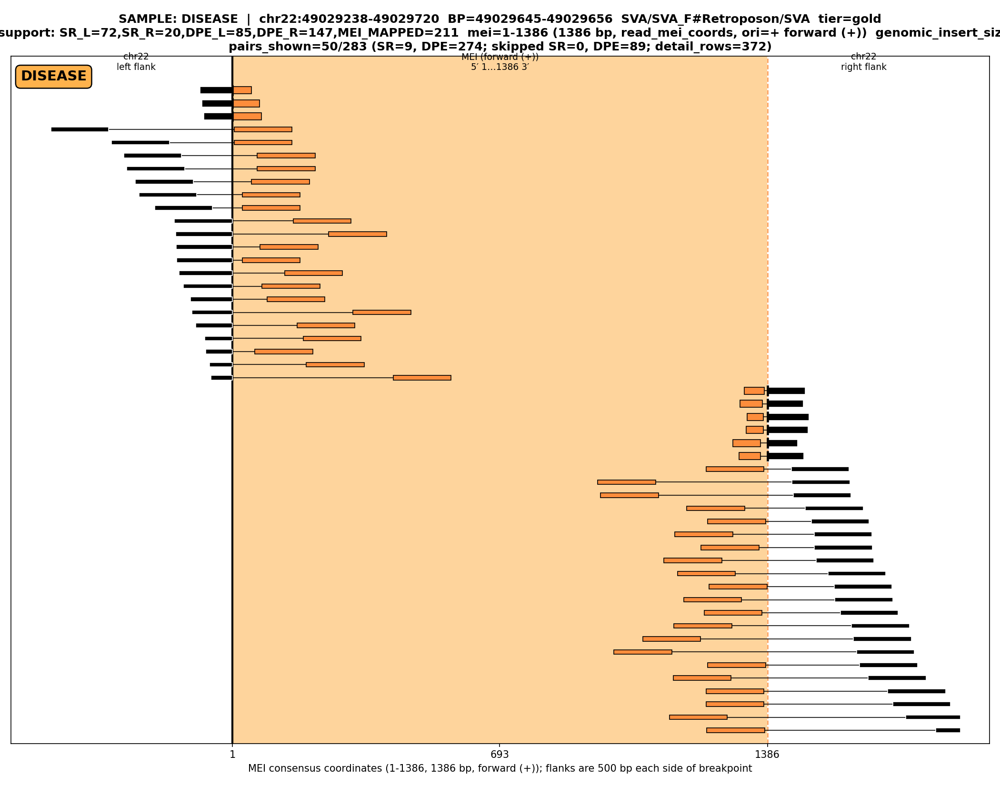
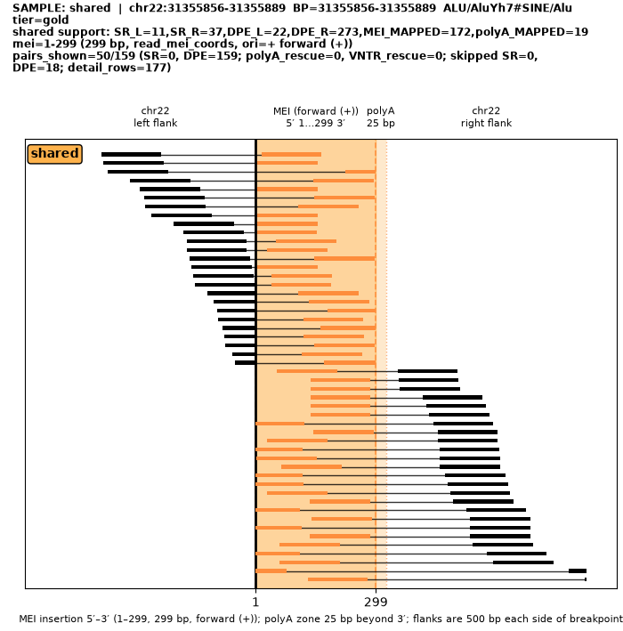

# retrotransposon-miner

Short-read mobile element insertion (MEI) detection and annotation pipeline for LINE-1, Alu, and SVA.

`retrotransposon-miner` searches next-generation sequencing data for retrotransposon (mobile element insertion, MEI) events in the human genome.
Retrotransposons are virus-like elements that can activate under stress and are implicated in disease biology.

The pipeline detects multiple MEI classes and outputs a candidate insertion table annotated with evidence and context useful for triage.

## What This Tool Can Do

- Detect mobile element insertion (MEI) candidates from short-read data using split-read and discordant paired-end evidence.
- Support paired disease/control (tumor-normal) workflows and control-focused/germline style analyses.
- Call major retrotransposon classes (`LINE-1`, `Alu`, `SVA`) and report family/subfamily assignments.
- Annotate candidates with:
  - estimated insertion coordinates,
  - polyA/polyT support,
  - target site duplication (TSD) length/sequence when resolvable,
  - overlap with known variant resources (short-read and long-read sets),
  - optional local assembly-derived features.
- Auto-generate review snapshots in IGV (Integrative Genomics Viewer) as PNG files for manual QC.
- Run cleanly in Linux environments with included bootstrap/validation scripts and an Amazon Elastic Compute Cloud (EC2)-first workflow.

## How It Compares to Other Tools

The table below summarizes `retrotransposon-miner` against commonly used tools (`xTea`, `mobster`, `MELT`, `RetroNet`, `TraFiC`, `TotalReCall`, `MEIba`).  
`retrotransposon-miner` feature claims are based on this repository; other-tool columns are high-level, publicly documented capability summaries and may vary by version/workflow.

Legend: `✅` yes, `❌` no, `➖` limited/partial/not definitive.

| Feature |  | xTea | mobster | MELT | RetroNet | TraFiC | TotalReCall | MEIba |
|---|---|---|---|---|---|---|---|---|
| Split-read support | ✅ | ✅ | ✅ | ✅ | ✅ | ➖ | ➖ | ➖ |
| Discordant paired-end support | ✅ | ✅ | ✅ | ✅ | ➖ | ✅ | ✅ | ➖ |
| Germline analysis | ✅ | ✅ | ✅ | ✅ | ✅ | ➖ | ➖ | ✅ |
| Paired disease/control analysis | ✅ | ✅ | ➖ | ➖ | ➖ | ✅ | ✅ | ➖ |
| Alu / SVA / LINE-1 | ✅ | ✅ | ✅ | ✅ | ✅ | ➖ | ➖ | ➖ |
| hg19 / GRCh38 / hs1 support | ✅ | ➖ | ➖ | ➖ | ➖ | ➖ | ➖ | ➖ |
| Target site duplication (TSD) detection | ✅ | ➖ | ➖ | ➖ | ➖ | ➖ | ➖ | ➖ |
| PolyA/polyT characterization | ✅ | ✅ | ✅ | ➖ | ✅ | ✅ | ✅ | ➖ |
| Annotation of known variant catalogs | ✅ | ➖ | ➖ | ✅ | ➖ | ➖ | ➖ | ➖ |
| Optional local assembly | ✅ | ✅ | ❌ | ❌ | ❌ | ❌ | ❌ | ❌ |
| Cloud support | ✅ | ➖ | ➖ | ➖ | ➖ | ➖ | ➖ | ➖ |
| Linux environment management scripts | ✅ | ➖ | ➖ | ➖ | ➖ | ➖ | ➖ | ➖ |
| Integrative Genomics Viewer (IGV) + JupyterLab workflow | ✅ | ❌ | ❌ | ❌ | ❌ | ❌ | ❌ | ❌ |

## Current Limitations

- Designed primarily for Amazon Web Services (AWS) machines today; relatively straightforward to adapt to Google Cloud Platform (GCP), Azure, or local Linux. For larger runs, `r6i.4xlarge` or greater is recommended, and local assembly/candidate processing support parallel execution.
- Artificial intelligence/machine learning (AI/ML) genotyping confidence models are still under active development.
- Reverse-transcribed pseudogene insertion support is not yet added.
- Support for species other than *Homo sapiens* (for example, *Mus musculus*) is not yet implemented.
- Long-read native calling is not yet supported.
- Single-cell sequencing data is not yet supported.
- Other short-read platforms (for example, Ultima Genomics) are not yet validated/supported.
- Local assembly is parallelized but still compute-expensive; it is optional and not recommended by default for routine runs.

## Example Variant Calls (GRCh38)

The table below lists candidate insertion calls from a tumor/normal chr22 run.  
In the example table, `SR` denotes split-read evidence and `DPE` denotes discordant paired-end evidence.

### Example output from sample tumor/normal data

Gold-tier calls from the SEQC2 tumor/normal chr22 annotate run after `COMPLEX_INS` demotion (top 25 of n=92 by review rank).

| chrom | consensus_insertion_breakpoint_pos | window_start | window_end | control_supporting_reads | disease_supporting_reads | sample_status_label | consensus_tsd_seq | consensus_poly_at_min_bp | consensus_mei_family | consensus_mei_subfamily | known_mei_polymorphism_id | known_mei_polymorphism_source | consensus_insertion_orientation | nested_in_same_MEI | consensus_insertion_mei_span_full | consensus_insertion_mei_5p_coord_full | consensus_insertion_mei_3p_coord_full |
| --- | --- | --- | --- | --- | --- | --- | --- | --- | --- | --- | --- | --- | --- | --- | --- | --- | --- |
| chr22 | 49029650 | 49029645 | 49029656 | SR_L=33,SR_R=11,DPE_L=2,DPE_R=152,BRK_CLP_L=33,BRK_CLP_R=10,MEI_MAPPED=130,polyA_MAPPED=46,VNTR_MAPPED=1,polyA_side=L | SR_L=72,SR_R=20,DPE_L=8,DPE_R=373,BRK_CLP_L=72,BRK_CLP_R=19,MEI_MAPPED=305,polyA_MAPPED=92,VNTR_MAPPED=1,polyA_side=L | shared | AAGAAAACTCCT | 50 | SVA | SVA_D#Retroposon/SVA | nssv14064350 | melt_1kg | + | unnested | 1386 | 1 | 1386 |
| chr22 | 37529051 | 37528956 | 37529146 | SR_L=0,SR_R=20,DPE_L=151,DPE_R=2,BRK_CLP_L=0,BRK_CLP_R=19,MEI_MAPPED=43,polyA_MAPPED=47,polyA_side=L | SR_L=1,SR_R=39,DPE_L=365,DPE_R=16,BRK_CLP_L=1,BRK_CLP_R=37,MEI_MAPPED=105,polyA_MAPPED=86,polyA_side=L | shared |  | 90 | ALU | AluYb8#SINE/Alu |  |  | + | nested | 311 | 1 | 311 |
| chr22 | 31355872 | 31355856 | 31355889 | SR_L=9,SR_R=15,DPE_L=7,DPE_R=148,BRK_CLP_L=7,BRK_CLP_R=14,MEI_MAPPED=47,polyA_MAPPED=6 | SR_L=11,SR_R=37,DPE_L=19,DPE_R=273,BRK_CLP_L=10,BRK_CLP_R=32,MEI_MAPPED=100,polyA_MAPPED=16,polyA_side=R | shared | GCCCGCCTCGGCTTCCCAAAGTGCTGGGATTACA | 71 | ALU | AluY#SINE/Alu |  |  | - | nested | 299 | 1 | 299 |
| chr22 | 17567662 | 17567655 | 17567669 | SR_L=6,SR_R=13,DPE_L=33,DPE_R=44,BRK_CLP_L=5,BRK_CLP_R=13,MEI_MAPPED=59,polyA_MAPPED=7,polyA_side=R | SR_L=18,SR_R=23,DPE_L=57,DPE_R=80,BRK_CLP_L=17,BRK_CLP_R=22,MEI_MAPPED=99,polyA_MAPPED=9,polyA_side=R | shared | TATCCTTGCTTTTAT | 61 | ALU | AluYb8#SINE/Alu | chr22-18235412-INS->s898803>s907604>s907605>s907606>s898804-358 | long_read_1kg_ont_vienna | - | unnested | 315 | 1 | 315 |
| chr22 | 33132520 | 33132513 | 33132527 | SR_L=30,SR_R=5,DPE_L=44,DPE_R=7,BRK_CLP_L=30,BRK_CLP_R=5,MEI_MAPPED=32,polyA_MAPPED=31,polyA_side=L | SR_L=23,SR_R=6,DPE_L=76,DPE_R=31,BRK_CLP_L=22,BRK_CLP_R=5,MEI_MAPPED=76,polyA_MAPPED=23,polyA_side=L | shared | AAAAGTCATTATTAG | 56 | ALU | AluYg6#SINE/Alu | nssv14075885 | melt_1kg | + | unnested | 311 | 1 | 311 |
| chr22 | 19223382 | 19223373 | 19223390 | SR_L=17,SR_R=12,DPE_L=60,DPE_R=27,BRK_CLP_L=17,BRK_CLP_R=12,MEI_MAPPED=76,polyA_MAPPED=17,polyA_side=L | SR_L=0,SR_R=0,DPE_L=0,DPE_R=0,BRK_CLP_L=0,BRK_CLP_R=0,MEI_MAPPED=0,polyA_MAPPED=0 | control_only | AAAAACCACCTATGCTGG | 66 | LINE1 | L1HS#LINE/L1 | g1k:nssv14064681|lr:chr22-19600083-INS->s899391<s914453>s899392-6059 | melt_1kg,long_read_1kg_ont_vienna | + | unnested | 6031 | 1 | 6031 |
| chr22 | 34034616 | 34034610 | 34034623 | SR_L=11,SR_R=12,DPE_L=62,DPE_R=1,BRK_CLP_L=11,BRK_CLP_R=12,MEI_MAPPED=50,polyA_MAPPED=14,polyA_side=R | SR_L=15,SR_R=30,DPE_L=92,DPE_R=2,BRK_CLP_L=15,BRK_CLP_R=28,MEI_MAPPED=74,polyA_MAPPED=32,polyA_side=R | shared | CAAATGGAACTTTT | 64 | ALU | AluYb8#SINE/Alu | nssv14071620 | melt_1kg | - | unnested | 314 | 1 | 314 |
| chr22 | 20521263 | 20520810 | 20521716 | SR_L=3,SR_R=7,DPE_L=39,DPE_R=19,BRK_CLP_L=1,BRK_CLP_R=3,MEI_MAPPED=39,polyA_MAPPED=19,polyA_side=R | SR_L=4,SR_R=6,DPE_L=55,DPE_R=33,BRK_CLP_L=2,BRK_CLP_R=3,MEI_MAPPED=73,polyA_MAPPED=20,polyA_side=R | shared |  | 28 | ALU | AluYa5#SINE/Alu |  |  | + | unnested | 304 | 1 | 304 |
| chr22 | 20075438 | 20075432 | 20075444 | SR_L=25,SR_R=23,DPE_L=128,DPE_R=19,BRK_CLP_L=17,BRK_CLP_R=19,MEI_MAPPED=69,polyA_MAPPED=51,polyA_side=L | SR_L=10,SR_R=18,DPE_L=89,DPE_R=16,BRK_CLP_L=5,BRK_CLP_R=15,MEI_MAPPED=34,polyA_MAPPED=40,polyA_side=R | shared | AGATTTCTTTTCT | 39 | ALU | AluYk3#SINE/Alu |  |  | - | unnested | 311 | 1 | 311 |
| chr22 | 40007330 | 40007328 | 40007332 | SR_L=16,SR_R=18,DPE_L=76,DPE_R=12,BRK_CLP_L=4,BRK_CLP_R=5,MEI_MAPPED=43,polyA_MAPPED=1,polyA_side=R | SR_L=32,SR_R=35,DPE_L=98,DPE_R=25,BRK_CLP_L=15,BRK_CLP_R=8,MEI_MAPPED=69,polyA_MAPPED=3,polyA_side=R | shared | CTCCT | 114 | ALU | AluYb8#SINE/Alu |  |  | - | unnested | 318 | 1 | 318 |
| chr22 | 42818496 | 42818163 | 42818830 | SR_L=0,SR_R=19,DPE_L=51,DPE_R=25,BRK_CLP_L=0,BRK_CLP_R=19,MEI_MAPPED=62,polyA_MAPPED=19,polyA_side=R | SR_L=0,SR_R=0,DPE_L=0,DPE_R=0,BRK_CLP_L=1,BRK_CLP_R=0,MEI_MAPPED=0,polyA_MAPPED=0 | control_only |  | 26 | ALU | AluYa5#SINE/Alu |  |  | + | unnested | 307 | 1 | 307 |
| chr22 | 17224410 | 17224401 | 17224418 | SR_L=5,SR_R=24,DPE_L=31,DPE_R=50,BRK_CLP_L=5,BRK_CLP_R=23,MEI_MAPPED=58,polyA_MAPPED=27,polyA_side=R | SR_L=0,SR_R=0,DPE_L=0,DPE_R=0,BRK_CLP_L=0,BRK_CLP_R=0,MEI_MAPPED=0,polyA_MAPPED=0 | control_only | AACAAGTGCTAATAATTT | 68 | ALU | AluYb8#SINE/Alu | g1k:nssv14074719|lr:chr22-17900865-INS->s898731>s907592>s898732-334 | melt_1kg,long_read_1kg_ont_vienna | - | unnested | 309 | 1 | 309 |
| chr22 | 41049714 | 41049079 | 41050348 | SR_L=3,SR_R=2,DPE_L=1,DPE_R=85,BRK_CLP_L=3,BRK_CLP_R=2,MEI_MAPPED=24,polyA_MAPPED=27,polyA_side=R | SR_L=3,SR_R=9,DPE_L=4,DPE_R=166,BRK_CLP_L=1,BRK_CLP_R=8,MEI_MAPPED=54,polyA_MAPPED=44,polyA_side=R | shared |  | 34 | ALU | AluYa5#SINE/Alu |  |  | + | unnested | 306 | 1 | 306 |
| chr22 | 22131266 | 22130567 | 22131964 | SR_L=1,SR_R=0,DPE_L=2,DPE_R=48,BRK_CLP_L=1,BRK_CLP_R=0,MEI_MAPPED=39,polyA_MAPPED=19,polyA_side=R | SR_L=0,SR_R=0,DPE_L=0,DPE_R=0,BRK_CLP_L=0,BRK_CLP_R=0,MEI_MAPPED=0,polyA_MAPPED=0 | control_only |  | 46 | LINE1 | L1HS#LINE/L1 |  |  | - | unnested | 394 | 5638 | 6031 |
| chr22 | 22131981 | 22131976 | 22131986 | SR_L=7,SR_R=16,DPE_L=44,DPE_R=1,BRK_CLP_L=7,BRK_CLP_R=16,MEI_MAPPED=32,polyA_MAPPED=16,polyA_side=R | SR_L=0,SR_R=0,DPE_L=0,DPE_R=0,BRK_CLP_L=0,BRK_CLP_R=0,MEI_MAPPED=0,polyA_MAPPED=0 | control_only | GCATATTTCTT | 46 | LINE1 | L1HS#LINE/L1 | nssv14066334 | melt_1kg | - | unnested | 6016 | 3 | 6018 |
| chr22 | 36091972 | 36091727 | 36092216 | SR_L=0,SR_R=0,DPE_L=10,DPE_R=1,BRK_CLP_L=0,BRK_CLP_R=0,MEI_MAPPED=2,polyA_MAPPED=11,polyA_side=R | SR_L=3,SR_R=9,DPE_L=50,DPE_R=36,BRK_CLP_L=2,BRK_CLP_R=7,MEI_MAPPED=29,polyA_MAPPED=34,polyA_side=L | disease_only |  | 46 | ALU | AluSc8#SINE/Alu |  |  | + | unnested | 310 | 1 | 310 |
| chr22 | 17289460 | 17289460 | 17289460 | SR_L=0,SR_R=9,DPE_L=0,DPE_R=38,BRK_CLP_L=0,BRK_CLP_R=9,MEI_MAPPED=19,polyA_MAPPED=0 | SR_L=0,SR_R=10,DPE_L=3,DPE_R=60,BRK_CLP_L=0,BRK_CLP_R=10,MEI_MAPPED=27,polyA_MAPPED=0 | shared |  | 74 | LINE1 | L1P2#LINE/L1 |  |  | - | unnested | 499 | 1056 | 1554 |
| chr22 | 34744709 | 34744435 | 34744983 | SR_L=2,SR_R=2,DPE_L=7,DPE_R=6,BRK_CLP_L=2,BRK_CLP_R=1,MEI_MAPPED=7,polyA_MAPPED=6,polyA_side=L | SR_L=3,SR_R=1,DPE_L=30,DPE_R=19,BRK_CLP_L=3,BRK_CLP_R=1,MEI_MAPPED=26,polyA_MAPPED=17,polyA_side=L | shared |  | 36 | ALU | AluSx1#SINE/Alu |  |  | - | unnested | 132 | 22 | 153 |
| chr22 | 31380168 | 31379903 | 31380433 | SR_L=2,SR_R=9,DPE_L=10,DPE_R=30,BRK_CLP_L=1,BRK_CLP_R=9,MEI_MAPPED=16,polyA_MAPPED=1,polyA_side=L | SR_L=0,SR_R=26,DPE_L=17,DPE_R=63,BRK_CLP_L=0,BRK_CLP_R=26,MEI_MAPPED=26,polyA_MAPPED=0 | shared |  | 66 | LINE1 | L1PA11#LINE/L1 |  |  | - | unnested | 2089 | 1671 | 3759 |
| chr22 | 48992288 | 48992285 | 48992290 | SR_L=1,SR_R=0,DPE_L=3,DPE_R=5,BRK_CLP_L=1,BRK_CLP_R=0,MEI_MAPPED=5,polyA_MAPPED=0 | SR_L=8,SR_R=4,DPE_L=21,DPE_R=13,BRK_CLP_L=7,BRK_CLP_R=4,MEI_MAPPED=25,polyA_MAPPED=0 | shared | ATAGAT | 5 | LINE1 | L1HS#LINE/L1 |  |  | - | unnested | 203 | 1 | 203 |
| chr22 | 45166725 | 45166719 | 45166731 | SR_L=14,SR_R=6,DPE_L=28,DPE_R=3,BRK_CLP_L=14,BRK_CLP_R=6,MEI_MAPPED=13,polyA_MAPPED=14,polyA_side=L | SR_L=54,SR_R=13,DPE_L=66,DPE_R=3,BRK_CLP_L=53,BRK_CLP_R=13,MEI_MAPPED=24,polyA_MAPPED=54,polyA_side=L | shared | AAAGAATTATGTC | 64 | ALU | AluYb9#SINE/Alu | g1k:nssv14054938|lr:chr22-45651200-INS->s904290<s909202>s904291-125 | melt_1kg,long_read_1kg_ont_vienna | + | unnested | 303 | 16 | 318 |
| chr22 | 19585579 | 19585579 | 19585579 | SR_L=15,SR_R=0,DPE_L=35,DPE_R=12,BRK_CLP_L=15,BRK_CLP_R=0,MEI_MAPPED=21,polyA_MAPPED=8,polyA_side=R | SR_L=0,SR_R=0,DPE_L=0,DPE_R=0,BRK_CLP_L=0,BRK_CLP_R=0,MEI_MAPPED=0,polyA_MAPPED=0 | control_only |  | 73 | ALU | AluSc8#SINE/Alu |  |  | - | unnested | 121 | 11 | 131 |
| chr22 | 40898245 | 40898226 | 40898264 | SR_L=4,SR_R=12,DPE_L=8,DPE_R=16,BRK_CLP_L=3,BRK_CLP_R=11,MEI_MAPPED=9,polyA_MAPPED=22,polyA_side=R | SR_L=6,SR_R=22,DPE_L=31,DPE_R=30,BRK_CLP_L=2,BRK_CLP_R=21,MEI_MAPPED=20,polyA_MAPPED=47,polyA_side=R | shared |  | 62 | ALU | AluYb8#SINE/Alu |  |  | - | nested | 318 | 1 | 318 |
| chr22 | 24791085 | 24791085 | 24791085 | SR_L=4,SR_R=0,DPE_L=15,DPE_R=3,BRK_CLP_L=4,BRK_CLP_R=0,MEI_MAPPED=12,polyA_MAPPED=0 | SR_L=5,SR_R=0,DPE_L=29,DPE_R=7,BRK_CLP_L=4,BRK_CLP_R=0,MEI_MAPPED=20,polyA_MAPPED=2,polyA_side=L | shared |  | 15 | ALU | AluY#SINE/Alu |  |  | + | nested | 289 | 23 | 311 |
| chr22 | 28337288 | 28337208 | 28337369 | SR_L=0,SR_R=2,DPE_L=0,DPE_R=21,BRK_CLP_L=0,BRK_CLP_R=1,MEI_MAPPED=20,polyA_MAPPED=0 | SR_L=2,SR_R=0,DPE_L=0,DPE_R=15,BRK_CLP_L=1,BRK_CLP_R=0,MEI_MAPPED=15,polyA_MAPPED=0 | shared |  | 7 | LINE1 | L1HS#LINE/L1 |  |  | + | unnested | 2017 | 2075 | 4091 |

## Examples

See [`docs/EXAMPLES.md`](docs/EXAMPLES.md) for additional annotated IGV review snapshots and read-architecture plots.

### Illumina


The gif shows screenshots from random sections of chromosome 22 in a healthy individual. Grey bars represent unmutated DNA, and colors indicate either a mutation or errors in sequencing. The final screenshot shows a barcode-like signature indicating a retrotransposon insertion at one location. This insertion was not previously reported in this individual in published studies using the same data.

### SVA insertion (GRCh38 chr22:49029650)



Top-ranked shared SVA (`SVA_D`, `nssv14064350`) with two-sided SR/DPE support, TSD `AAGAAAACTCCT`, and polyA/VNTR rescue counts in the support string. Full-consensus span is ~1–1386.

### Alu insertion (GRCh38 chr22:31355872)



Top-ranked shared Alu (`AluYh7`) with a long TSD (`GCCCGCCTCGGCTTCCCAAAGTGCTGGGATTACA`) and near-full consensus coverage (~1–299).

### LINE-1 insertion (GRCh38 chr22:22131981)


Known control-only LINE-1 (`L1HS`, `nssv14066334`) with split-read and discordant paired-end support. Panel `L1HS_5end` / `L1HS_3end` hits are projected onto the shared full-length L1 axis (near-full ~3–6018), not min/max’d on short fragment references.

## Getting Started on Amazon EC2 (Elastic Compute Cloud)

For whole-genome runs, use at least `r6i.4xlarge`.

The EC2 helper script (`scripts/ec2_jlab.sh`) works with **any existing EC2 instance** in your AWS account. Instance IDs and names are **not hardcoded in the repository**; each user binds their own instance locally to `.ec2-instance.env` (gitignored).

Run `./scripts/ec2_jlab.sh help` for the full command list.

### Quick Start (Bring Your Own EC2)

From your local machine:

```bash
git clone https://github.com/<org>/retrotransposon-miner.git
cd retrotransposon-miner
chmod +x scripts/ec2_jlab.sh
./scripts/ec2_jlab.sh list-instances
./scripts/ec2_jlab.sh use <instance-id-or-name>
./scripts/ec2_jlab.sh up
ssh retro-ec2
```

One-shot bind, start, and SSH config:

```bash
./scripts/ec2_jlab.sh up <instance-id-or-name>
./scripts/ec2_jlab.sh connect
```

After the instance is running:
- Secure Shell (SSH): `ssh retro-ec2`
- JupyterLab (after `start-jlab` + `start-tunnel`): `http://127.0.0.1:8890/lab?token=<printed-token>`

### Create a New EC2 Instance

Use `bootstrap` only when you want the script to provision a new instance (key pair, security group, Elastic IP, JupyterLab):

```bash
./scripts/ec2_jlab.sh bootstrap
```

`start-instance`, `stop-instance`, and `reboot-instance` operate on the **bound** instance only and do not create new instances.

### EC2 CLI Reference

| Command | Description |
|---|---|
| `list-instances` | List EC2 instances in the configured region |
| `use <instance-id-or-name>` | Bind an instance (by ID or `Name` tag) and update SSH config |
| `up [instance-id-or-name]` | Bind (optional), start, refresh SSH config |
| `connect [instance-id-or-name]` | `up` + SSH |
| `status` | Show bound instance state |
| `start-instance` | Start the bound instance |
| `stop-instance` | Stop the bound instance |
| `reboot-instance` | Reboot the bound instance |
| `bootstrap` | Create and configure a new EC2 instance |
| `start-jlab` / `stop-jlab` / `start-tunnel` | JupyterLab lifecycle |
| `help` | Show usage |

Optional environment variables:

- `REGION` — AWS region (default: from `aws configure`, else `us-east-1`)
- `INSTANCE_ID` / `INSTANCE_NAME` — override bound instance without editing `.ec2-instance.env`
- `HOST_ALIAS` — SSH config alias (default: `retro-ec2`)
- `SSH_USER` — SSH login user (auto-detected from AMI if unset; e.g. `ec2-user`, `ubuntu`)
- `KEY_PATH` — path to PEM for the instance key pair
- `INSTANCE_TYPE` — instance type for `bootstrap` only (default: `r6i.4xlarge`)

Binding is saved to `.ec2-instance.env` in the repo checkout. Rebind anytime with `use`.

### Prerequisites

Local tools:
- `aws` command-line interface (CLI) v2 (`aws configure` complete)
- `ssh`
- `curl`
- `git`

Identity and Access Management (IAM) permissions:

For bring-your-own-EC2 (`use`, `up`, `connect`, lifecycle commands):
- `ec2:Describe*`
- `ec2:StartInstances`
- `ec2:StopInstances`
- `ec2:RebootInstances`
- `ec2:AuthorizeSecurityGroupIngress` (SSH proxy refreshes your current IP on connect)

Additional permissions for `bootstrap` (new instance provisioning):
- `ec2:RunInstances`
- `ec2:CreateTags`
- `ec2:CreateKeyPair`
- `ec2:CreateSecurityGroup`
- `ec2:AllocateAddress`
- `ec2:AssociateAddress`
- `ec2:DescribeAddresses`
- `ec2:DescribeVpcs`
- `ec2:DescribeSubnets`
- `ssm:GetParameter` (Amazon Linux AMI lookup)
- `iam:PassRole` (if attaching an instance profile)

### What `scripts/ec2_jlab.sh` Does

- Binds to any existing EC2 instance by ID or `Name` tag (`use`).
- Saves the binding locally in `.ec2-instance.env` (not committed to git).
- Starts, stops, and reboots the bound instance without creating new ones.
- Writes SSH aliases (`retro-ec2`, `jlab`) into local `~/.ssh/config`.
- Refreshes SSH security group ingress for your current public IP on connect.
- Optionally creates a new instance (`bootstrap`), key pair, security group, and Elastic IP.
- Starts JupyterLab remotely and tunnels it locally.

### Quickstart Runs (chr22)

Use the main workflow wrapper:

- `scripts/run_candidate_discovery_and_annotation.sh`

Important: these quickstart commands do not download reference/public inputs automatically.

Step 0: download public/reference data first using the provided script:

```bash
conda activate rtm-miner || micromamba activate rtm-miner
python3 scripts/download_public_data.py \
  --references hg38 \
  --categories test_bam \
  --outdir "${RTM_PUBLIC_DATA_DIR:-$HOME/retrotransposon-workdir/data/public}"
```

SEQC2 chr22 test BAMs are sliced to chr22 **plus interchrom discordant mates** (needed for
discordant-mate MEI minimap alignment). Re-download with `--force` after updating the downloader.

If you plan to run both GRCh38 and hs1 workflows:

```bash
conda activate rtm-miner || micromamba activate rtm-miner
python3 scripts/download_public_data.py \
  --references hg38 hs1 \
  --outdir "${RTM_PUBLIC_DATA_DIR:-$HOME/retrotransposon-workdir/data/public}"
```

Tumor/normal chr22 quickstart (SEQC2 public test pair):

Local assembly is **off by default** (faster; sufficient for minimap mate mapping and
`supporting_reads_detail.mei.tsv`). Pass `--local-assembly` when you need `asm_*`
breakpoint/TSD fields from per-locus SPAdes.

Empirical gold gating (`--empirical-stage`) is also **off by default** (expensive BAM
depth/MAPQ/NM null sampling with little callset impact). Pass `--empirical-stage` only
when you want that extra filter.

Gold also requires `MEI_MAPPED>=3` in disease **or** control (silver loci with only 1–2
MEI-mapped reads stay silver). This keeps review/IGV/read-architecture plots focused on
better-supported calls.

```bash
RUN_IN_ENV=1 bash scripts/run_candidate_discovery_and_annotation.sh \
  --reference-build hg38 \
  --disease-bam "${RTM_PUBLIC_DATA_DIR:-$HOME/retrotransposon-workdir/data/public}/test_data/seqc2/chr22/disease.chr22.hg38.bam" \
  --control-bam "${RTM_PUBLIC_DATA_DIR:-$HOME/retrotransposon-workdir/data/public}/test_data/seqc2/chr22/control.chr22.hg38.bam" \
  --disease-mate-bam "${RTM_PUBLIC_DATA_DIR:-$HOME/retrotransposon-workdir/data/public}/test_data/seqc2/chr22/disease.chr22.hg38.bam" \
  --control-mate-bam "${RTM_PUBLIC_DATA_DIR:-$HOME/retrotransposon-workdir/data/public}/test_data/seqc2/chr22/control.chr22.hg38.bam" \
  --mei-fasta "${RTM_PUBLIC_DATA_DIR:-$HOME/retrotransposon-workdir/data/public}/retrotransposon_db/dfam/dfam_human_mei_l1_alu_sva.fasta" \
  --chr chr22 \
  --outdir "${RTM_RESULTS_DIR:-$HOME/retrotransposon-workdir/results}/quickstart_seqc2_chr22"
```

For SEQC2 chr22 BAMs built with `include_discordant_mates`, point `--disease-mate-bam` /
`--control-mate-bam` at the same files as `--disease-bam` / `--control-bam`.

Re-run annotation only (reuse existing `split_evidence.*` / `candidate_loci.tsv` after code or
BAM changes that affect minimap mate alignment). Local assembly and empirical stage stay off
unless you pass `--local-assembly` / `--empirical-stage`:

```bash
RUN_IN_ENV=1 bash scripts/run_candidate_discovery_and_annotation.sh \
  --reference-build hg38 \
  --annotate-only \
  --disease-bam "${RTM_PUBLIC_DATA_DIR:-$HOME/retrotransposon-workdir/data/public}/test_data/seqc2/chr22/disease.chr22.hg38.bam" \
  --control-bam "${RTM_PUBLIC_DATA_DIR:-$HOME/retrotransposon-workdir/data/public}/test_data/seqc2/chr22/control.chr22.hg38.bam" \
  --disease-mate-bam "${RTM_PUBLIC_DATA_DIR:-$HOME/retrotransposon-workdir/data/public}/test_data/seqc2/chr22/disease.chr22.hg38.bam" \
  --control-mate-bam "${RTM_PUBLIC_DATA_DIR:-$HOME/retrotransposon-workdir/data/public}/test_data/seqc2/chr22/control.chr22.hg38.bam" \
  --mei-fasta "${RTM_PUBLIC_DATA_DIR:-$HOME/retrotransposon-workdir/data/public}/retrotransposon_db/dfam/dfam_human_mei_l1_alu_sva.fasta" \
  --chr chr22 \
  --outdir "${RTM_RESULTS_DIR:-$HOME/retrotransposon-workdir/results}/mei_step1_hg38_chr22"
```

Pipeline outputs include `supporting_reads_detail.mei.tsv` (per-read anchor/mate MEI coords for
architecture plots). Annotate writes gold-only plots under
`<out>.read_architecture/` by default (`--no-read-architecture-plots` to skip).

Single locus or batch from an existing gold review table:

```bash
# one locus (tables loaded once via cache)
python scripts/plot_locus_read_architecture.py \
  --gold-review-tsv "${RTM_RESULTS_DIR:-$HOME/retrotransposon-workdir/results}/quickstart_seqc2_chr22/candidate_loci.mei.gold_review.tsv" \
  --chrom chr22 --pos 49029650 --sample disease \
  --out-png "${RTM_RESULTS_DIR:-$HOME/retrotransposon-workdir/results}/quickstart_seqc2_chr22/plots/read_arch_chr22_49029650.png"

# all gold loci (same load-once path)
python scripts/plot_locus_read_architecture.py \
  --gold-review-tsv "${RTM_RESULTS_DIR:-$HOME/retrotransposon-workdir/results}/quickstart_seqc2_chr22/candidate_loci.mei.gold_review.tsv" \
  --all-gold \
  --out-dir "${RTM_RESULTS_DIR:-$HOME/retrotransposon-workdir/results}/quickstart_seqc2_chr22/read_architecture"
```

HG0001-style germline/control chr22 quickstart (replace with your BAM path):

```bash
bash scripts/run_candidate_discovery_and_annotation.sh \
  --reference-build hg38 \
  --disease-bam "/path/to/HG0001.chr22.hg38.bam" \
  --control-bam "/path/to/HG0001.chr22.hg38.bam" \
  --mei-fasta "${RTM_PUBLIC_DATA_DIR:-$HOME/retrotransposon-workdir/data/public}/retrotransposon_db/dfam/dfam_human_mei_l1_alu_sva.fasta" \
  --chr chr22 \
  --outdir "${RTM_RESULTS_DIR:-$HOME/retrotransposon-workdir/results}/quickstart_hg0001_chr22"
```

### Sync Repository on Virtual Machine (VM)

```bash
cd ~
git clone https://github.com/<org>/retrotransposon-miner.git
cd retrotransposon-miner
```

### Install Environment on Virtual Machine (VM)

```bash
bash scripts/bootstrap_env.sh
bash scripts/install_ucsc_tools.sh
conda activate rtm-miner || micromamba activate rtm-miner
bash scripts/validate_environment.sh
```

If needed:

```bash
eval "$($HOME/.local/bin/micromamba shell hook -s bash)"
micromamba activate rtm-miner
```

### Download Public Data

GRCh38:

```bash
conda activate rtm-miner || micromamba activate rtm-miner
python3 scripts/download_public_data.py \
  --references hg38 \
  --outdir "${RTM_PUBLIC_DATA_DIR:-$HOME/retrotransposon-workdir/data/public}"
```

hs1:

```bash
conda activate rtm-miner || micromamba activate rtm-miner
python3 scripts/download_public_data.py \
  --references hs1 \
  --outdir "${RTM_PUBLIC_DATA_DIR:-$HOME/retrotransposon-workdir/data/public}"
```

Both:

```bash
conda activate rtm-miner || micromamba activate rtm-miner
python3 scripts/download_public_data.py \
  --references hg38 hs1 \
  --outdir "${RTM_PUBLIC_DATA_DIR:-$HOME/retrotransposon-workdir/data/public}"
```

### Connect From Cursor

1. Open command palette.
2. Run `Remote-SSH: Connect to Host...`
3. Select `retro-ec2`.
4. Open `~/retrotransposon-miner`.

### Notes

- Designed for headless Linux execution with optional Integrative Genomics Viewer (IGV) snapshot generation.
- Instance bindings are local (`.ec2-instance.env`); nothing instance-specific is committed to git.
- If your public IP changes, SSH connect refreshes security group ingress automatically via `ec2_jlab.sh`.
- Set `KEY_PATH` if your PEM is not in `~/.ssh/` or the default search paths.
- For production use, review security hardening, key lifecycle, and cost controls.

## License

This project is licensed under the Apache License 2.0.

- Full text: [`LICENSE`](LICENSE)
- SPDX identifier: `Apache-2.0`

## Contributing

Contributions are welcome and encouraged.

- Contribution guide: [`CONTRIBUTING.md`](CONTRIBUTING.md)
- Community standards: [`CODE_OF_CONDUCT.md`](CODE_OF_CONDUCT.md)
- Contact: open a GitHub issue/discussion first, or email `william [at] l1tx [dot] com`.

If you submit code, please include clear validation steps and update documentation when behavior changes.

## Repository Metadata

- Repository description: `Retrotransposon mobile element insertion (MEI) caller for short-read whole-genome sequencing (WGS) with split-read + discordant-pair evidence, candidate ranking, MEI annotation, and Integrative Genomics Viewer (IGV) snapshot review workflows.`
- GitHub topics: `retrotransposon`, `mobile-element-insertion`, `mei`, `line1`, `alu`, `sva`, `genomics`, `bioinformatics`, `structural-variation`, `nextflow`, `igv`, `jupyterlab`, `aws`, `ec2`.
- Search keywords: `retrotransposon detection`, `mobile element insertion calling`, `LINE-1 insertion`, `Alu insertion`, `SVA insertion`, `short-read MEI pipeline`, `tumor normal MEI`, `germline MEI`, `IGV MEI review`.
