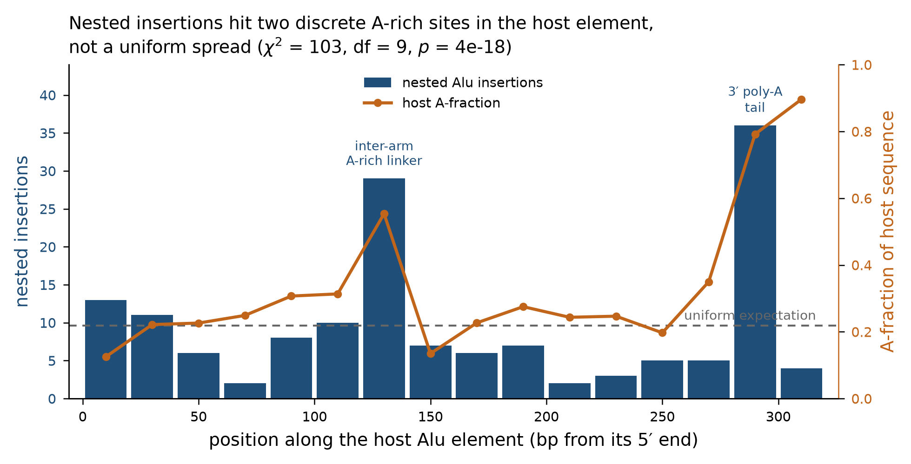

# Retrotransposon self-insertion in HG03086

**Question (W. Brandler):** do MEI insertions favour inserting into existing reference
copies of their own family, and when they do, is the new insertion in the same orientation
as the reference element? Following his clarification — *"we would want to annotate
nested_sense and nested_antisense and compare the two"* — the two orientation classes are
treated as separate categories throughout rather than as a single same-orientation rate.

**Answers.** Same-family nesting exceeds the selected placement nulls for Alu and LINE-1.
For SVA the result is 9 observed vs 0.306 expected (n=9; repeat-aware callability untested),
so it remains provisional. Nummi et al. 2025 report SVA self-target preference, providing
systematic precedent but not validation of these nine calls. The nested set has a strong
same-orientation tendency for Alu and LINE-1; within-nested tests and category-vs-placement
tests are distinct. Among AluY insertions, young-host targeting is above an abundance-based
expectation (1.86×), an age-associated pattern compatible with—but not proof of—homology-
mediated targeting. The orientation tendency remains unexplained by these analyses: tested
motif/opportunity models do not explain its magnitude, and no enrichment was detected for
CCATT under the selected control. These results do not assign or exclude a route.

**Scope note.** This is the table-driven report and retains exploratory subfamily and motif
sections. See the [integrated evidence report](NESTED_MEI_INTEGRATED_REPORT_2026-10-02.md)
for the current literature-reconciled synthesis and the [validation input guide](SELFINS_VALIDATION_INPUT_GUIDE.md)
for the blocked sequence/read-backed checks. The figures, tables, and quantitative summaries below
are rendered into both this Markdown and PDF by this script.

Callset: 1852 classifier calls (score ≥ 0.997) on HG03086, GRCh38, chr1–22 + chrX —
one genome, which bounds several results below. Reference elements: UCSC hg38 RepeatMasker,
filtered to Alu / LINE-1 / SVA with the pipeline's own family-normalisation rule
(`_normalize_mei_family_token`). 320 of 1852 calls
(17.3%) fall inside a same-family element.

---

## 1. Same-family nesting against family-specific selected nulls

Two nulls, each resampling call positions genome-wide 1,000 times — **uniform**, and
**GC-matched** on each call's local GC (1 kb window). Empirical p-values at 0.000999 are
at the simulation floor, not precise tail-probability estimates.

| family | n | nested | observed | GC-matched exp. | uniform exp. | conservative enrichment | p |
|---|---|---|---|---|---|---|---|
| Alu | 1555 | 239 | 0.154 | 0.096 | 0.105 | **1.47×** | < 0.001 |
| LINE-1 | 222 | 72 | 0.324 | 0.220 | 0.177 | **1.47×** | < 0.001 |
| SVA | 75 | 9 | 0.120 | 0.004 | 0.001 | **29.41×** | < 0.001 |

The selected null differs by family. GC matching yields an Alu expectation of
149.6 vs 162.5 under uniform
(1.60× vs 1.47×), and raises expectations for LINE-1 and SVA relative to uniform. These are model-dependent
placement comparisons; neither null is proven universally correct. Polymorphic AluY in this callset have lower mean GC than fixed reference AluY (0.385 vs 0.441).
This descriptive contrast does not by itself separate integration preference from sequence
composition, ascertainment, or survival/selection.

## 2. Sense and antisense, as separate categories

Host-element selection is **orientation-blind**: where several same-family elements overlap a
breakpoint the longest is chosen, never the one whose strand matches. The pipeline's own
`_annotate_nested_retrotransposon` scores candidates `(same_orient, length)`, so reusing it
would have folded the tie-break into the measurement.

| family | nested | same orientation | rate | 95% CI | odds ratio | Fisher p |
|---|---|---|---|---|---|---|
| Alu | 239 | 202 | **0.845** | 0.793–0.889 | 30.0 | 1.4e-28 |
| LINE-1 | 72 | 53 | **0.736** | 0.619–0.833 | 7.2 | 0.000202 |
| SVA | 9 | 9 | **1.000** | 0.664–1.000 | ∞ | 0.00794 |

Splitting the two classes and testing each against the null separately is where the single
rate turns out to be hiding something:

| family | category | observed | expected | enrichment | p |
|---|---|---|---|---|---|
| Alu | `nested_sense` | 202 | 81.27 | **2.49×** | 3.4e-29 |
| Alu | `nested_antisense` | 37 | 81.27 | **0.46×** | 6.2e-08 |
| LINE-1 | `nested_sense` | 53 | 24.43 | **2.17×** | 7.6e-07 |
| LINE-1 | `nested_antisense` | 19 | 24.43 | **0.78×** | 0.318 |
| SVA | `nested_sense` | 9 | 0.15 | **58.82×** | 2.2e-13 |
| SVA | `nested_antisense` | 0 | 0.15 | **0.00×** | 1 |

Against the orientation-blind placement simulations, Alu antisense nesting is below the
selected null (0.46×, p = 6.2e-08), whereas LINE-1 antisense is compatible with its null
(0.78×, p = 0.318). These are category-vs-placement tests, not a direct sense-vs-antisense
contrast among nested calls. The conditional same-orientation fractions and their binomial
tests are reported separately above; Alu's marginal-based expectation (0.500) is close to,
but not conceptually identical with, the 0.5 binomial baseline.

**The chance baseline is close to the marginal-based expectation, but the tests are distinct.** For Alu, new insertions are 0.502 `+` and reference hosts are 0.515 `+`, giving an independence-expected same-orientation rate of 0.500. The saved conditional exact-binomial test uses 0.5; the saved Fisher test uses the actual orientation marginals. These are similar here, not the same model in general.

### A limited subfamily negative control

Nested calls carry different subfamily-age distributions from non-nested calls, which argues
against one simple host-sequence misassignment explanation. It is not a general exclusion of
calling or mapping artefacts; the orientation split by age is a robustness check, not read-level
validation:

| family | subset | n | same orientation | p vs 0.5 |
|---|---|---|---|---|
| Alu | young only | 140 | 0.843 | 4.5e-17 |
| Alu | old only | 99 | 0.848 | 8.2e-13 |
| LINE-1 | young only | 36 | 0.694 | 0.0288 |
| LINE-1 | old only | 36 | 0.778 | 0.00119 |

Only 5.9% of nested Alu calls carry a subfamily label identical to their host element
(0.0% for LINE-1). This argues against one simple same-label host re-detection explanation;
it is not a general exclusion of calling or mapping artefacts and does not independently
validate the calls.

## 3. AluY host-age pattern (sequence similarity is not isolated)

Restricting to young AluY-subfamily insertions and asking which host they land in, against an
expectation proportional to each host class's share of genomic Alu bp:

| host element | genomic bp | observed | expected | enrichment | p |
|---|---|---|---|---|---|
| AluY (youngest) | 38.6 Mb | 33 | 17.7 | **1.86×** | 0.000762 |
| AluS (intermediate) | 187.0 Mb | 76 | 85.9 | **0.88×** | 0.154 |
| AluJ (oldest) | 72.6 Mb | 24 | 33.3 | **0.72×** | 0.0573 |
| other | 6.5 Mb | 7 | 3.0 | **2.35×** | 0.0326 |

The final row is a heterogeneous remainder (FLAM, FRAM and other non-age-graded Alu-family
annotations); it is listed so the table accounts for all 140 insertions
rather than only the 133 that fall on the age
axis, and it carries no interpretation.

The abundance-based table shows an age-associated distribution: young AluY insertions favour young hosts (1.86×, p = 0.000762), while the oldest AluJ class is below expectation (0.72×, p = 0.0573). Host age is only a proxy for sequence similarity and also covaries with composition, genomic location, and survival; this result does not by itself demonstrate homology-directed integration. Jacob-Hirsch et al. 2018 describe homology/abundance effects for a distinct somatic-brain LINE-1 class. The direction is qualitatively compatible, but the cohorts and mechanisms differ, so this is not a direct replication.

This age-associated pattern does not explain orientation: same-orientation fractions are
similar across host-age strata (0.875 AluJ, 0.829 AluS, 0.818 AluY, n = 24 / 76 / 33).
A simple model in which host homology drives the orientation preference would predict a
stronger same-orientation fraction in more similar hosts; these data do not show that trend.

### Where inside the host element insertions land: two A-rich peaks

Levy, Schwartz & Ast (2009 online; 2010 issue, *Nucleic Acids Research* 38:1515–1530, doi:10.1093/nar/gkp1134; Results p. 1518, Figure 2) report a prominent Alu-into-Alu insertion hotspot directly after the A-rich linker at targeted-Alu consensus coordinate 133. Their Figure 2 describes the AluJo consensus and labels the internal A-rich linker at 118–136; Figure 1 defines insertion position as the coordinate just upstream of the insertion. Under a 5′-aligned consensus-to-host convention, coordinate 133 falls in our 120–140 bp bin, with the breakpoint around the 133/134 boundary—not an exact bin edge. The paper does not explicitly say that 133 is counted from the first consensus nucleotide, so that mapping is an inference. Figure 2's sense-oriented Alu self-insertion display uses 15,759 Alu self-insertion events. Our 20-bp profile is positionally compatible, not a nucleotide-resolution replication.

The HG03086 distribution across deciles of the host element is strongly non-uniform —
**χ² = 103 on 9 df, p = 3.7e-18**, with a
Kolmogorov–Smirnov test against uniform giving D = 0.161, p = 7.0e-06
(n = 239 nested Alu calls).

Restricting to near-full-length host Alus (154 calls, host 280–320 bp)
so base offsets are comparable, and binning at 20 bp against a uniform expectation of
9.6 per bin:

| position in host | insertions | host A-fraction | region |
|---|---|---|---|
| 280–300 bp | **36** (3.7×) | 0.79 | 3′ poly-A tail |
| 120–140 bp | **29** (3.0×) | 0.55 | inter-arm A-rich linker |
| 0–20 bp | **13** (1.4×) | 0.13 | 5′ end — not A-rich |

The separate 280–300 bp peak (36, 3.7×) is near the terminal poly(A) tail under this host convention. Levy et al. excluded target-element consensus ends from positional tests because of RepeatMasker/short-flank identification limitations, so their data do not directly adjudicate our terminal-tail cluster. This is a coverage blind spot, not evidence by itself that the cluster is novel or genuine. Nummi et al. 2025 independently report germline Alu target peaks at 100–155 and 260–310 bp, broadly covering both of our peak windows, but their long-read cohort and positional method differ.

Insertion count correlates with host A-fraction across bins (Pearson r = +0.513, p = 0.0422) but not rank-wise (Spearman ρ = +0.063, p = 0.815): the association is carried by discrete peaks, not a smooth gradient. Neither positional peak validates its individual insertions as authentic TPRT events.

This bears on §4. The motif models tested there fail to predict the orientation *magnitude*. A-rich target positions coincide with the two larger positional peaks, but this positional association does not explain the orientation result.

The 5′-most bin carries 13 insertions at low
A-content (0.13) and has no mechanistic account.
It sits at an element boundary, where breakpoint-assignment edge effects are the leading
explanation; it is flagged rather than interpreted.

## 4. Orientation: tested models do not explain the observed tendency

The age-associated host-choice result in §3 does not account for orientation. Three
sequence/opportunity hypotheses are evaluated below; none explains the observed magnitude.

**Narrow endonuclease consensus (`TTTT/AA`).** Counting sense- and antisense-compatible sites
inside host elements predicted the family-level rate closely — Alu
0.842 against observed 0.845, LINE-1
0.731 against 0.736. That agreement
does not survive. It was computed over elements weighted by *genomic abundance*, dominated by
old low-prediction copies; weighted by the subfamilies that actually received insertions the
same model predicts 0.920 against an observed 0.842. Two weightings landing near each other
is not a prediction, and across subfamilies the model was rejected outright.

**Full degenerate consensus (`YY/RRRR`).** `TTTT/AA` is one instance of the published L1 EN
consensus; scoring only it misses every other variant. Recounting on the full degenerate
pattern:

| family | predicted (degenerate) | predicted (narrow) | observed |
|---|---|---|---|
| Alu | 0.658 | 0.842 | **0.845** |
| LINE-1 | 0.647 | 0.731 | **0.736** |
| SVA | 0.679 | 0.834 | **1.000** |

The tested full degenerate consensus predicts a lower same-orientation fraction than
observed for each family. Across host subfamilies its predictions have little range relative
to the observed fractions. This model does not account for the observed magnitude; it does
not establish that endonuclease opportunity is biologically irrelevant.

Method check: genome-wide the two consensus orientations occur at
203.3 and 201.4 sites per 10 kb — ratio **1.009**. This background check finds no global
strand skew in the motif counts; it does not by itself explain the nested-call orientation
pattern.

**CCATT target motif (literature context, not route assignment).** Jacob-Hirsch et al. report a
CCATT-associated EN-independent route for a specific somatic-brain nested L1 class. Against a
control matched for element composition—random positions *inside same-family elements*, since
nested sites sit in element sequence by construction—no enrichment was detected in this
callset under this control: 2.06 vs 1.79 per kb, rate ratio 1.15, **p = 0.445**. This does not
establish that these calls used the classical route; route assignment needs independent
junction, truncation, and target-motif evidence.

The observed orientation tendency is pronounced in these nested calls, but remains unexplained by the tested sequence/opportunity models. These tests do not establish that the corresponding biological mechanisms are absent.

**Levy et al.'s “~4-fold” figure has a different unit than this report's enrichment.** The “~4-fold” figure from Levy et al. 2010 is not the ratio of total insertions into TE sequence to insertions into non-TE sequence. It is the ratio of enriched to depleted insertion-type categories: 516 overrepresented versus 116 underrepresented insertion-type categories out of 36,478 tested (young × old × orientation), i.e. ~4.45:1 by category. Their per-type null is random insertion into unique intergenic DNA scaled to each old TE class’s inferred ancestral coverage. Any total-event ratio must be computed from the underlying event counts, which the paper does not report as a single number.

That category-count result is not directly comparable to §1's family-specific observed-vs-resampled event counts; the two answer different statistical questions. Levy et al.'s exact-insertion database is a broader set than the young-into-old unique-intergenic analysis.

These tests identify hypotheses not supported by the current measurements; they do not rule
out the corresponding biological mechanisms. The orientation tendency remains unexplained by
this analysis.

## 5. Pipeline annotation context (separate from validation of this callset)

Earlier pipeline output collapsed same-family opposite-orientation overlaps into the `unnested`
label, so those records could not be separated from genuinely non-nested calls using that field
alone. In the analysis-table reconstruction, 56 same-family opposite-orientation calls were identified (37 Alu, 19 LINE-1). This describes a pipeline-annotation limitation and is not
read-level validation of the current callset.

The analysis reconstructed the two orientation classes independently of that collapsed field.
A separate pipeline branch documented in the prior project handoff added a four-valued `NESTED`
enum (branch/test details are not independently reverified in this report):

| value | meaning |
|---|---|
| `unnested` | no same-family element overlaps the breakpoint |
| `nested_sense` | overlaps; insertion orientation matches the element strand |
| `nested_antisense` | overlaps; orientations differ |
| `nested_unknown` | overlaps, but orientation is unresolvable on one side |

`nested_unknown` retains records whose host or insertion orientation cannot be resolved.
For this report's analysis, host selection was reconstructed without preferring matching
strands; raw reads were not independently validated.

## 6. Limitations

- **One genome.** HG03086 is the only genome-wide callset in the project; other samples are
  chr22 slices. These are catalogue-pattern estimates for one individual, not population-wide
  integration rates.
- **SVA is provisional.** 9 nested calls (9 observed vs 0.306 expected under the selected
  GC-matched null). Repeat-aware callability/mappability was not modeled, so the 29.4× ratio
  is not a settled effect estimate. Nummi et al. 2025 report systematic SVA self-target
  preference, which is precedent—not validation of these nine calls.
- **Genic vs intergenic: not assessed.** The sense fraction is
  0.851 genic against
  0.811 intergenic,
  but with 37
  intergenic events the comparison can only detect a 21-point difference at 80% power. This
  is absence of power, not absence of effect, and is reported as such.
- **Orientation mechanism is open.** The age-associated host-choice result does not explain
  orientation. Tested motif/opportunity models do not account for its magnitude; this does not
  prove the corresponding biological mechanisms absent.
- **Read-backed validation is incomplete.** Repetitive loci challenge short-read evidence.
  The current checkout lacks HG03086 BAM/CRAM and the full reference sequence needed to
  reconstruct junctions; known-source and read-support annotations do not substitute for
  independent per-locus validation.
- **Element boundaries affect the rate, not the orientation result.** An earlier draft
  asserted that RepeatMasker annotates Alu poly-A tails separately from element bodies, so
  that tail-primed insertions would fall outside the interval and understate nesting. That
  was checked and is **false**: on chr1, 0.8% of 98,824 Alu elements have a
  separately annotated adjacent poly-A/T, so the tail is almost always inside the annotation.
  The real boundary question was tested directly by relaxing every interval by a fixed slop
  and recomputing both the nesting flag and the host strand from scratch at each step:

| slop | Alu nested | Alu same-orient | LINE-1 nested | LINE-1 same-orient |
|---|---|---|---|---|
| ±0 bp | 0.154 | 0.845 | 0.324 | 0.736 |
| ±10 bp | 0.170 | 0.848 | 0.369 | 0.768 |
| ±25 bp | 0.188 | 0.836 | 0.383 | 0.765 |
| ±50 bp | 0.208 | 0.815 | 0.423 | 0.723 |
| ±100 bp | 0.250 | 0.787 | 0.441 | 0.714 |
| ±250 bp | 0.329 | 0.691 | 0.491 | 0.679 |

  The nesting **rate** is boundary-dependent, as any interval-overlap statistic is — but the
  enrichment in §1 compares observed against a null built from the same intervals, so the
  comparison is like-for-like at whatever boundary is used. The **orientation** result is
  robust: still 0.815 for Alu and 0.723 for LINE-1 at ±50 bp, decaying only
  as flanking non-element sequence — where no orientation relationship exists — is pulled in.

## Prior work

| year | citation | bearing on this analysis |
|---|---|---|
| 2009/2010 | Levy, Schwartz & Ast | Primary genome-wide nested-TE study. Results p. 1518 and Figure 2 place an Alu-into-Alu hotspot just after the A-rich linker at AluJo consensus coordinate 133 (linker 118–136); under 5′ consensus-to-host alignment this falls in our 120–140 bp bin. Figure 1 defines insertion position; Figure 2's sense-oriented Alu self-insertion display uses 15,759 Alu self-insertion events. The breakpoint is near 133/134; mapping is an inference, not a bin assignment in the paper. Target-end exclusion does not test our 280–300 bp tail cluster. Their ‘~4-fold’ figure is 516 overrepresented versus 116 underrepresented insertion-type categories out of 36,478 tested, not an aggregate event ratio. Their per-type null is random insertion into unique intergenic DNA scaled to each old TE class’s inferred ancestral coverage; the paper does not report a total-event ratio as a single number. |
| 2010 | Kojima 2010 | Discusses differences in cis- and trans-mobilized insertion structure. These observations are context for family differences, not a direct prediction of the nested-orientation split measured here. |
| 2018 | Jacob-Hirsch et al. 2018 | This is mechanistic context for a particular somatic-brain L1 class, not a numerical comparator for inherited mixed-family events. The current CCATT control detects no enrichment under its chosen background; it does not assign the route used by these calls. |
| 2019 | Flasch et al. 2019 | Mechanistic context for possible alternatives; it does not predict the particular nested orientation counts measured here. |
| 2025 | Nummi et al. 2025 | Independent systematic precedent for SVA self-target preference and similar broad Alu positional regions. Cohort, ascertainment, and methods differ; these results do not validate individual HG03086 calls or remove its callability caveat. |

## Reproducing

Run `python artifacts/build_selfins_report.py` from the repository root to regenerate this
Markdown and `selfins_report.pdf` from the same report text, tables, and figures. Quantitative
summaries are read from saved results; literature context and interpretation are curated in
the generator template. PDF rendering requires ReportLab (`python -m pip install -r
artifacts/requirements-pdf.txt`).

| file | contents |
|---|---|
| `selfins_per_call.csv` | all calls with host element, nesting, orientation |
| `selfins_enrichment.csv` | both nulls, all three families |
| `selfins_sense_antisense.csv` | the two orientation classes tested separately |
| `selfins_orientation.csv` | orientation tests with marginals and Fisher results |
| `selfins_orientation_sensitivity.csv` | young/old subfamily split |
| `selfins_homology_test.csv` | host-age preference for young insertions |
| `selfins_en_degenerate_family.csv` | degenerate `YY/RRRR` recount, family level |
| `selfins_en_degenerate_subfamily.csv` | the same per subfamily, where it is rejected |
| `selfins_en_motif_prediction.csv` | the earlier narrow `TTTT/AA` count |
| `selfins_ccatt_control.csv` | CCATT control, composition-matched |
| `selfins_genome_background_en.json` | genome-wide consensus density, both orientations |
| `selfins_position_profile.csv` | insertion counts and host A-fraction per 20 bp bin (§3) |
| `selfins_position_deciles.csv` | decile counts underlying the uniformity test (§3) |
| `selfins_position_stats.json` | χ², KS and correlation statistics for §3 |
| `selfins_boundary_sensitivity.csv` | nesting and orientation as element boundaries are relaxed |
| `selfins_polya_annotation_check.json` | whether rmsk annotates Alu poly-A tails separately |
| `alu_insertion_vs_retention_gc.csv` | insertion vs retention GC contrast |
| `nested_orientation_literature.csv` | prior work with per-paper bearing |
