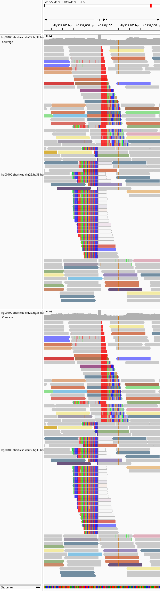
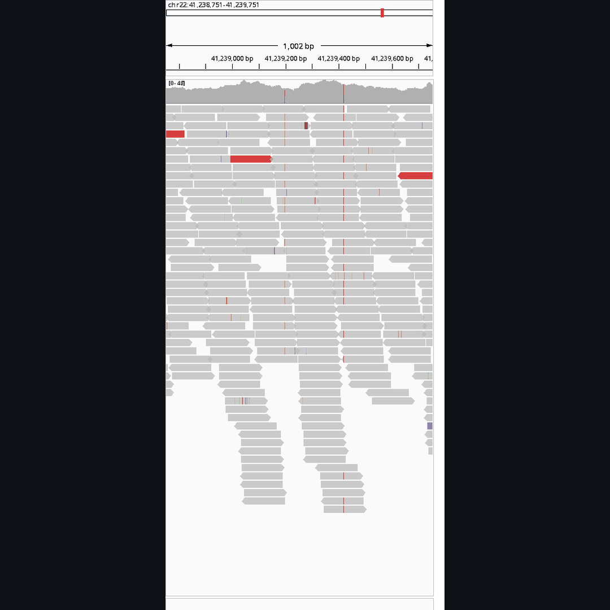
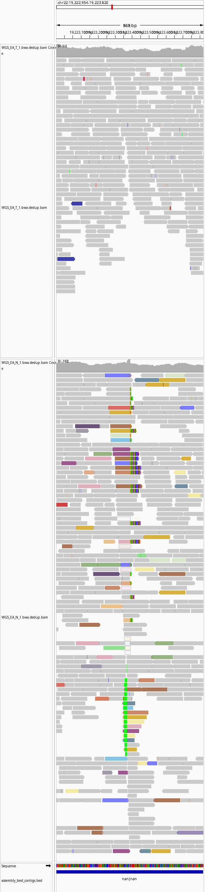
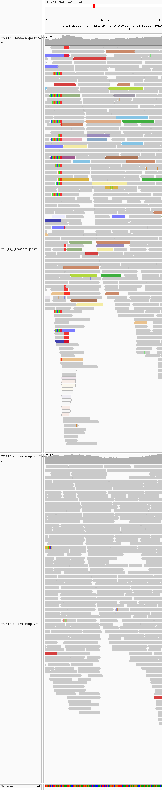
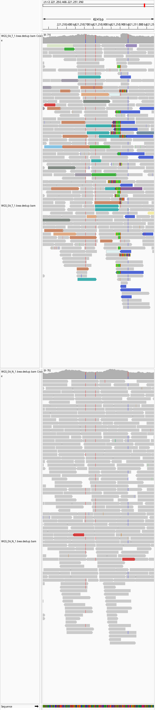
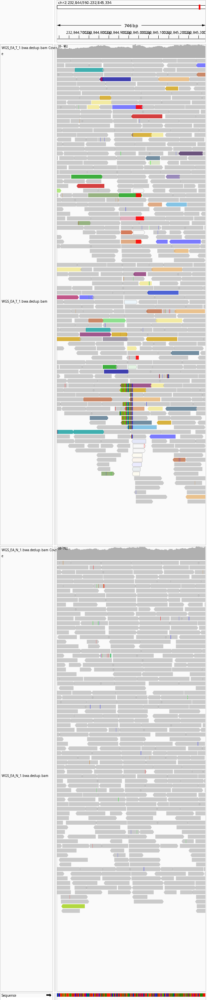
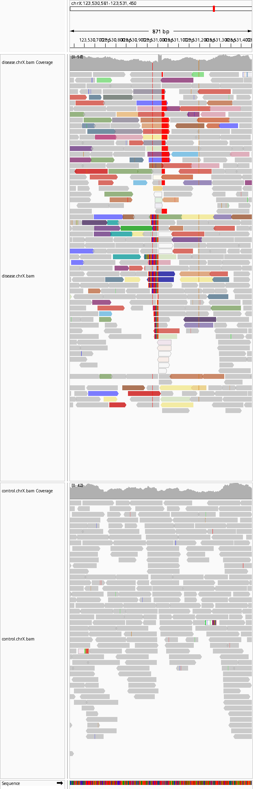

# Examples

Integrative Genomics Viewer (IGV) review snapshots generated by the pipeline.

## Illumina

The gif shows screenshots from random sections of chromosome 22 in a healthy individual. Grey bars represent unmutated DNA, and colors indicate either a mutation or errors in sequencing. The final screenshot shows a barcode-like signature indicating a retrotransposon insertion at one location. This insertion was not previously reported in this individual in published studies using the same data.

### GRCh38 chr22:46938819-46939335 - novel LINE-1 in HG00100

Novel variant in HG00100 not detected by 1000 Genomes short-read or long-read sequencing.  
Evidence includes a LINE-1 insertion, target site duplication (TSD) sequence `GAGACACCATTTTT`, an approximately 29 bp polyA tail (shown as red polyT in IGV due to negative-strand orientation), 5' split-read support, and discordant paired-end support on both sides of the breakpoint.

### GRCh38 chr22:17567258-17567931 - full-length Alu known from long-read data

Full-length Alu insertion previously reported only from long-read sequencing (`chr22-18235412-INS->s898803>s907604>s907605>s907606>s898804-358`).  
TSD sequence `TATCCTTGCTTTTAT` and a 12 bp polyA signal are present (negative-strand orientation), with additional A-rich sequence that may have reduced prior short-read detectability.

An outreach-oriented GIF without the final annotation panel is available at `examples/grch38_hg00100_known_longread_alu_chr22_17567258_17567931_outreach.gif`. Both GIFs are 1080×1080 (LinkedIn/iPhone friendly) and pause on the final frame. Regenerate with `python scripts/make_locus_zoom_gif.py`.

### GRCh38 chr22:19222954-19223820 - control-only LINE-1 with probable tumor deletion context

LINE-1 insertion seen in control only on positive strand (polyA shown as green block).  
Reduced tumor coverage suggests a clonal deletion of the chromosome carrying this variant; nearby control-only variants are consistent with a larger deletion event in the tumor.

### GRCh38 chr2:101944086-101944588 - tumor-only novel nested LINE-1

Tumor-only novel LINE-1 insertion nested inside another LINE-1 in the same orientation.

### GRCh38 chr2:221250468-221251090 - tumor-only novel non-canonical LINE-1

Additional tumor-only novel LINE-1 insertion with no obvious polyA tail, suggesting possible non-canonical insertion biology.

### GRCh38 chr2:232844590-232845334 - tumor-only novel unnested LINE-1

Additional tumor-only novel LINE-1 insertion that is unnested.

### GRCh38 chrX:123530581-123531450 - tumor-only novel nested LINE-1

Novel tumor-only nested LINE-1 insertion on chromosome X.

### GRCh38 chr22:49029650 - top-ranked SVA (read architecture)

Known SVA insertion (`nssv14064350`, MELT) with two-sided SR/DPE support into a forward-oriented `SVA_D` consensus.  
Breakpoint interval `49029645-49029656`, TSD `AAGAAAACTCCT`, polyA/VNTR rescue in the support string, and full-consensus span ~1–1386. Overlapping split seeds for this event are merged into one candidate window.

An IGV-style snapshot of the same locus is at `examples/grch38_known_sva_chr22_49029238_49029720.png`.

### GRCh38 chr22:31355872 - top-ranked Alu (read architecture)

Shared Alu (`AluYh7`) at `chr22:31355872` (interval `31355856-31355889`) with TSD `GCCCGCCTCGGCTTCCCAAAGTGCTGGGATTACA` and near-full consensus coverage (~1–299).

### GRCh38 chr22:22131981 - known LINE-1 with split-read and discordant-pair support

LINE-1 (`L1HS`) insertion at `chr22:22131981` (breakpoint interval `22131976-22131986`), annotated as a known 1000 Genomes polymorphism (`nssv14066334`, MELT).  
Control-only with TSD `GCATATTTCTT`. Panel `L1HS_5end` / `L1HS_3end` alignments are projected onto the shared full-length L1 axis (near-full ~3–6018) rather than min/max’d on short fragment references.
